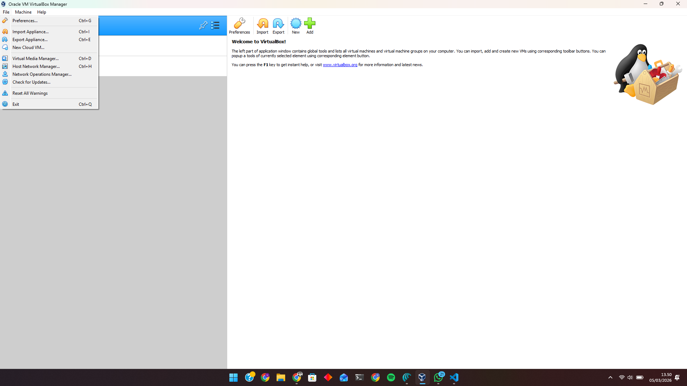
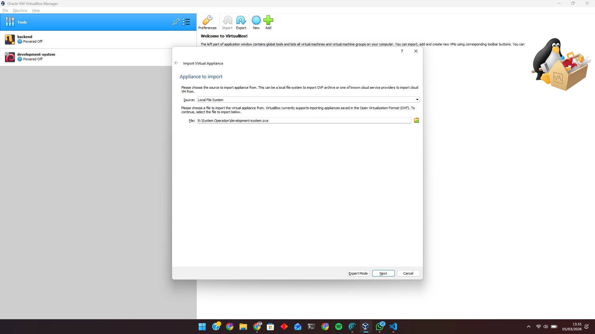
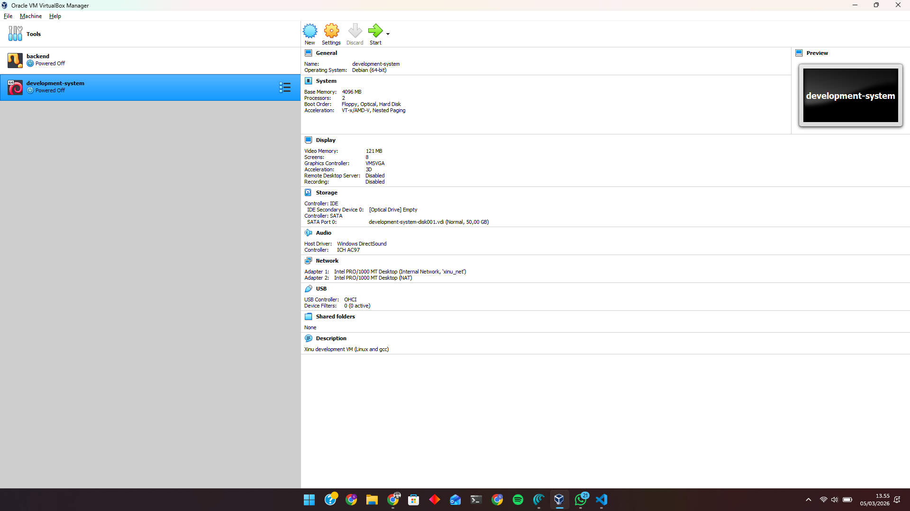
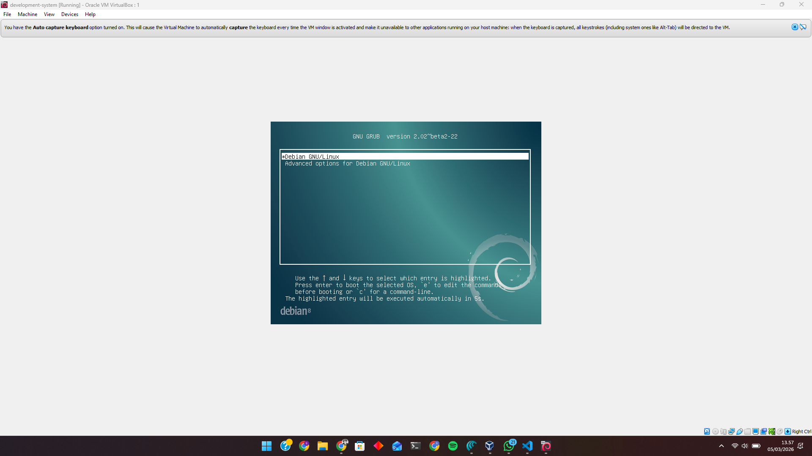
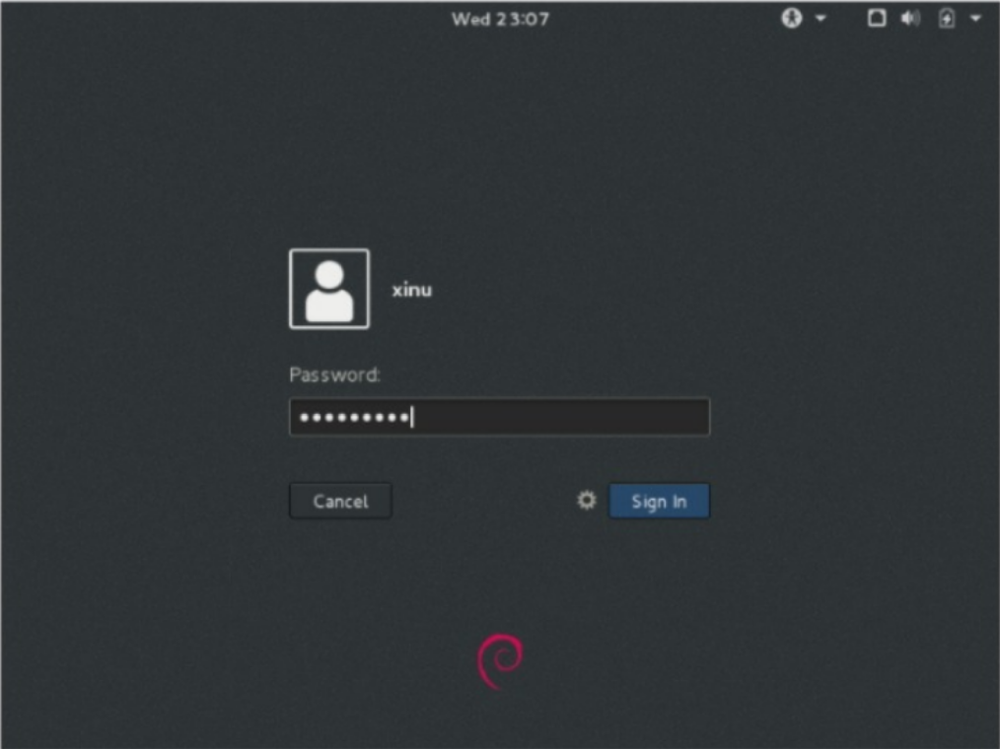

# <h1 align="center">Laporan Praktikum Modul 02  Instalasi Xinu</h1>

Satria Ramadhan - 2311104026

## Dasar Teori

### Virtualisasi dan Hypervisor (VirtualBox)

> Virtualisasi adalah teknik menjalankan beberapa sistem operasi tamu (guest) di atas satu komputer fisik melalui lapisan perangkat lunak bernama hypervisor. Hypervisor tipe 2 (hosted hypervisor) berjalan di atas sistem operasi host dan digunakan untuk keperluan desktop, pengembangan, dan praktikum karena instalasi dan penggunaannya relatif sederhana.
> Oracle VM VirtualBox adalah hypervisor tipe 2 yang berjalan di atas Windows, Linux, macOS, dan Solaris sebagai host, lalu menyediakan mesin virtual untuk berbagai guest OS seperti Ubuntu dan Xinu. VirtualBox mendukung fitur seperti snapshot, guest multiprocessing, dan dukungan ACPI yang bermanfaat untuk eksperimen dan pengujian di lingkungan praktikum

### Sistem Operasi Umum: Ubuntu di VirtualBox

> Ubuntu adalah distribusi GNU/Linux yang digunakan sebagai sistem operasi guest untuk menjalankan perintah, kompilasi program, dan eksplorasi konsep dasar sistem operasi seperti manajemen proses dan file system. Menjalankan Ubuntu di VirtualBox memberi lingkungan terisolasi sehingga praktikan bisa bereksperimen tanpa merusak sistem utama, serta memudahkan reset kondisi lewat snapshot jika terjadi kesalahan konfigurasi.

### Xinu
> Xinu (Xinu Is Not Unix) adalah sistem operasi kecil yang dirancang khusus sebagai OS pendidikan, dengan kode yang relatif sederhana namun tetap mendukung proses, memori dinamis, I/O perangkat, jaringan, dan file system. Meskipun namanya mirip Unix, desain internal Xinu berbeda dan dibuat agar struktur komponen (proses, IPC, driver, protokol) mudah dipelajari

## Guided

### Instalasi Development System & Backend
1. Buka pada bagian file pada Virtual Box lalu klik Import Appliance

2. Setelah itu cari sumber file development-system.ova

3. Setelah itu tinggal next -> import
4. Settingan Xinu

### Menjalankan Xinu
1. Jalankan Development-system (Start)

2. Login Xinu

## Referensi

1. [https://xinu.cs.purdue.edu/](https://xinu.cs.purdue.edu/)
2. [https://www.virtualbox.org/manual/topics/Introduction.html](https://www.virtualbox.org/manual/topics/Introduction.html)
