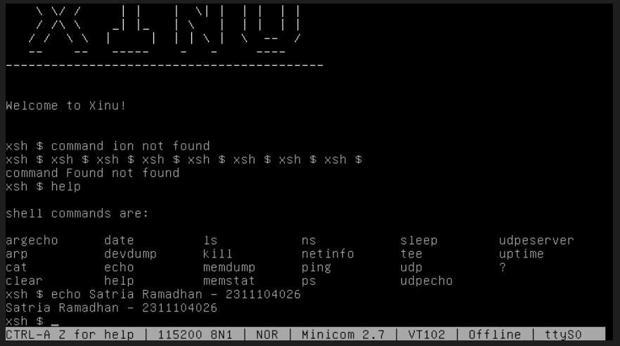
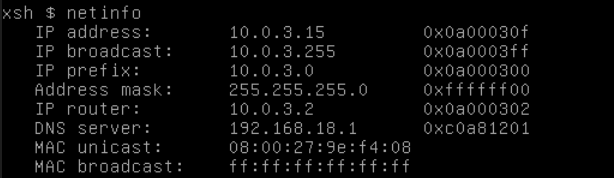
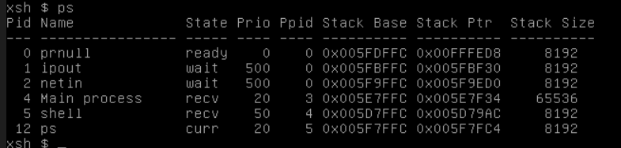

# <h1 align="center">Laporan Praktikum Modul 03  Eksplorasi Xinu</h1>

Satria Ramadhan - 2311104026

## Dasar Teori

> Sistem operasi Xinu menggunakan arsitektur dual-VM yang memisahkan antara lingkungan pengembangan (development system) dan lingkungan eksekusi (backend). Dalam mekanisme ini, proses kompilasi kode sumber dilakukan di development system menggunakan tool make untuk menghasilkan image biner bernama xinu.boot, yang kemudian diunggah ke server TFTP. Prosedur booting pada mesin backend dilakukan melalui jaringan menggunakan protokol PXE, di mana mesin tersebut akan mengunduh image OS dari server dan menjalankannya, sementara interaksi pengguna dilakukan melalui komunikasi serial virtual menggunakan aplikasi Minicom untuk mengakses shell Xinu (xsh).

## Guided

### Menjalankan Xinu dan Eksekusi Perintah

1.  Pada system development xinu terdapat banyak perintah, contohnya adalah help, echo.
    
    Berikut adalah uraian penjelasan dari perintah xinu:

    | No  | Perintah       | Penjelasan Fungsi                                                            |
    | :-- | :------------- | :--------------------------------------------------------------------------- |
    | 1   | **argecho**    | Menampilkan kembali argumen baris perintah yang diketikkan pengguna.         |
    | 2   | **arp**        | Menampilkan atau memanipulasi tabel _Address Resolution Protocol_ (ARP).     |
    | 3   | **cat**        | Menggabungkan atau menampilkan isi dari sebuah file/perangkat ke layar.      |
    | 4   | **clear**      | Membersihkan seluruh teks pada layar terminal shell.                         |
    | 5   | **date**       | Menampilkan atau mengatur informasi tanggal dan waktu sistem.                |
    | 6   | **devdump**    | Menampilkan informasi teknis dan status dari perangkat (_devices_) sistem.   |
    | 7   | **echo**       | Menampilkan baris teks atau string yang diinputkan ke standar output.        |
    | 8   | **help**       | Menampilkan daftar seluruh perintah yang tersedia dalam shell.               |
    | 9   | **ls**         | Menampilkan daftar isi direktori atau file dalam sistem.                     |
    | 10  | **kill**       | Menghentikan atau mematikan proses tertentu berdasarkan PID (_Process ID_).  |
    | 11  | **memdump**    | Menampilkan isi memori (dump) dalam format heksadesimal.                     |
    | 12  | **memstat**    | Menampilkan statistik penggunaan memori (jumlah memori bebas dan terpakai).  |
    | 13  | **ns**         | Melakukan kueri ke _Name Server_ untuk mendapatkan informasi domain.         |
    | 14  | **netinfo**    | Menampilkan informasi konfigurasi jaringan (IP Address, Mask, Gateway).      |
    | 15  | **ping**       | Mengirim paket ICMP ke host tujuan untuk mengecek konektivitas jaringan.     |
    | 16  | **ps**         | Menampilkan daftar proses yang aktif beserta status, prioritas, dan PID-nya. |
    | 17  | **sleep**      | Menunda eksekusi shell selama jangka waktu (detik) yang ditentukan.          |
    | 18  | **tee**        | Membaca input dan menuliskannya ke standar output sekaligus ke file.         |
    | 19  | **udp**        | Menampilkan informasi atau status terkait protokol UDP.                      |
    | 20  | **udpecho**    | Menjalankan klien atau layanan _echo_ menggunakan protokol UDP.              |
    | 21  | **udpeserver** | Menjalankan layanan server UDP pada sistem Xinu.                             |
    | 22  | **uptime**     | Menunjukkan durasi waktu sejak sistem Xinu pertama kali dinyalakan.          |
    | 23  | **?**          | Memiliki fungsi yang identik dengan `help` (menampilkan daftar perintah).    |

### Jawablah pertanyaan-pertanyaan berikut ini

1. Berapa jumlah perintah pada Xinu?
   > Jumlah perintah xinu sesuai dengan pada list ketika running perintah `help` adalah 23.
2. Sebutkan 2 perintah yang mempunyai fungsi yang sama!
   > perintah `help` dan juga `?` ini memiliki output yang sama.
3. Berapa IP address Xinu?
   > IP address xinu dapat dilihat dengan menjalankan perintah `netinfo`, yaitu 10.0.3.15
   > 
4. Perintah apa yang digunakan untuk mengetahui IP address?
   > Dengan menjalankan perintah `netinfo` akan mendapatkan output informasi mengenai ip address, sesuai dengan lampiran gambar pada pertanyaan ke-3
5. Berapa IP DNS server yang digunakan oleh Xinu?
   > IP DNS Server yang digunakan xinu dapat dilihat pada perintah `netinfo`, yaitu 192.168.18.1 mengikuti dari dns server jaringan internal.
6. Terdapat berapa proses yang sedang berjalan pada Xinu?
   > Untuk melihat berapa proses yang berjalan pada xinu dapat menjalankan perintah `ps`, yaitu 5 process.
   > 
7. Proses apa yang mempunyai prioritas paling rendah?
   > Proses yang memiliki prioritas paling rendah pada Xinu adalah `prnull` dengan priority `0`
8. Proses apa yang mempunyai ukuran paling besar?
   > Proses yang paling besar adalah Main Process sesuai dengan output perintah `ps`
9. Proses apa yang berada dalam state current?
   > Proses ketika menjalankan perintah `ps`
10. Proses apa yang berada dalam state suspend?
    > Tidak ada. Dengan menjalankan `ps` kita dapat melihat state dari semua proses yang sedang berjalan, pada output dari perintah tersebut tidak ada proses yang sedang dalam state _suspend_
11. Berapa PID (Process ID) dari Main process?
    > Untuk melihat brapa PID dari sebuah process dapat dilihat melalui perintah `ps`, Main process memiliki Process ID sebesar `3`.

## Referensi

1. [Modul Sistem Operasi](https://telkomuniversityofficial-my.sharepoint.com/personal/maghaz_student_telkomuniversity_ac_id/_layouts/15/onedrive.aspx?id=%2Fpersonal%2Fmaghaz%5Fstudent%5Ftelkomuniversity%5Fac%5Fid%2FDocuments%2F2026%2F00%2E%20Modul%20Praktikum%20Sistem%20Operasi%20SE%202526%2D2%2Epdf&parent=%2Fpersonal%2Fmaghaz%5Fstudent%5Ftelkomuniversity%5Fac%5Fid%2FDocuments%2F2026&ga=1)
