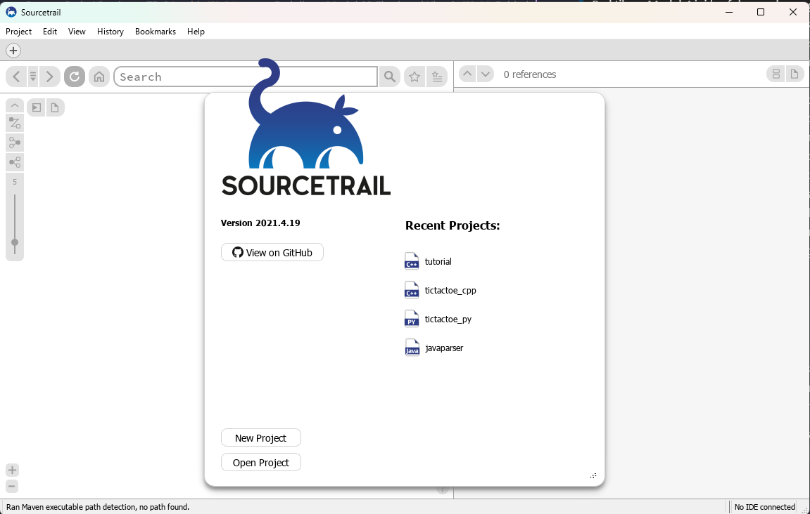
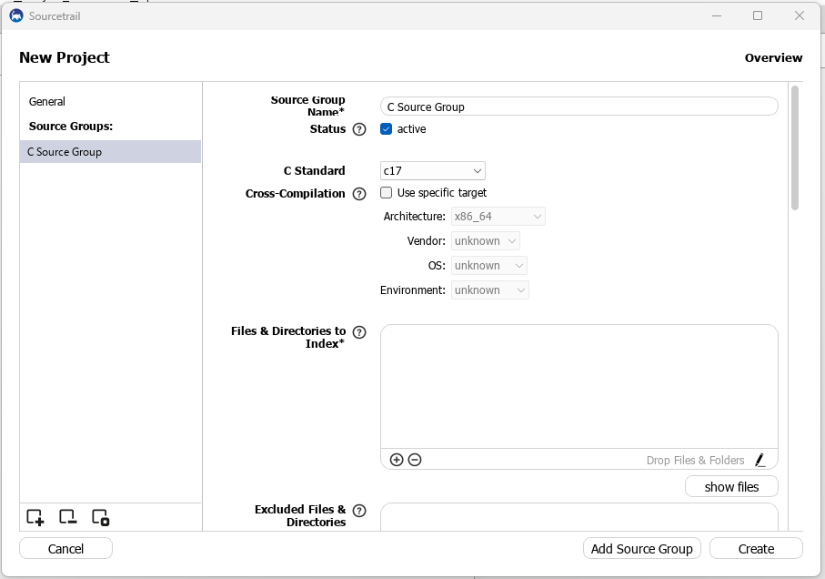
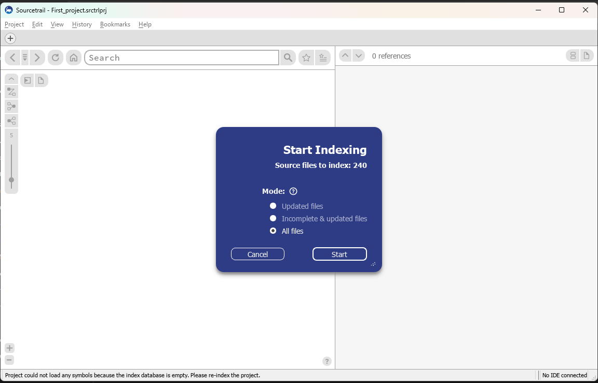
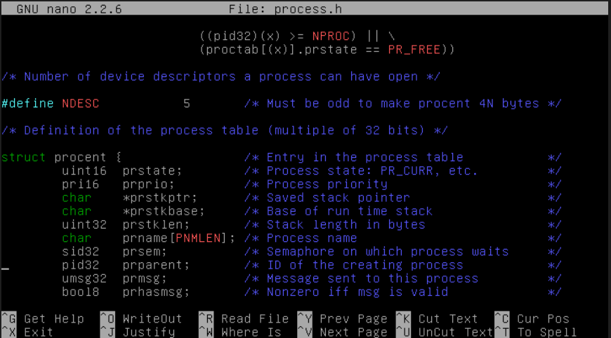
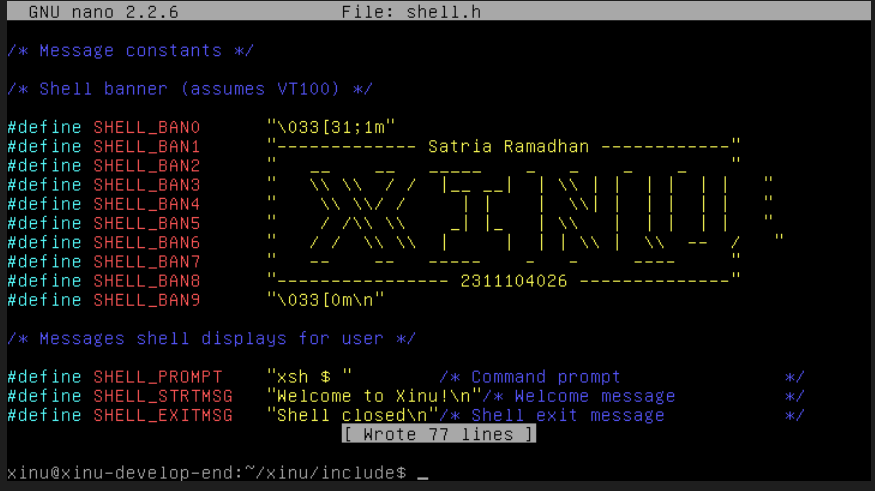
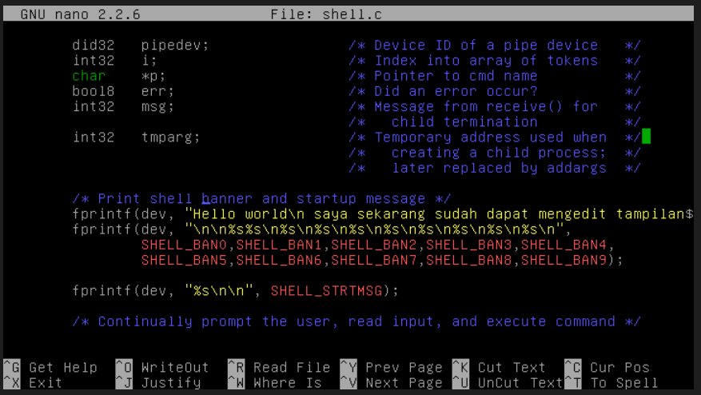
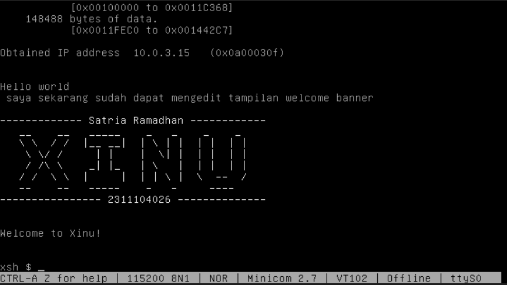

# <h1 align="center">Laporan Praktikum Modul 04  Eksplorasi Xinu</h1>

Satria Ramadhan - 2311104026

## Dasar Teori

> Praktikum Modul 4 ini berfokus pada pengembangan kemampuan mahasiswa dalam membaca, memahami struktur, serta melakukan modifikasi sederhana pada source code sistem operasi Xinu. Dalam proses eksplorasinya, mahasiswa dapat menggunakan perangkat lunak Sourcetrail untuk memetakan keterkaitan kode atau menggunakan perintah grep pada Linux untuk mencari lokasi spesifik dari suatu struktur data atau kata kunci di dalam direktori proyek. Pemahaman mengenai manajemen sistem dilakukan dengan mempelajari file header berekstensi .h yang menyimpan informasi penting, seperti struktur data proses. Selain itu, praktikum ini mengajarkan teknik kustomisasi sistem melalui pengubahan welcome banner yang melibatkan modifikasi pada file di direktori xinu/include dan xinu/shell. Setelah modifikasi selesai, mahasiswa wajib melakukan kompilasi ulang menggunakan perintah make clean dan make di dalam folder compile untuk menghasilkan file image terbaru, yang kemudian dijalankan melalui backend dengan bantuan minicom untuk memverifikasi hasilnya.

## Guided

1. [10 Poin] Apa nama image yang dihasilkan setelah melakukan kompilasi pada Xinu? Berapa ukuran file tersebut? Ada pada folder apa file image tersebut?
   Hint: baca kembali modul-modul sebelumnya

   > Nama image setelah kompilasi pada xinu adalah `xinu.elf`, dengan ukuran file 156kb. File `xinu.elf` berada pada folder `xinu/compile`

2. Membaca source code Xinu

   > step by step menggunakan sourcetrail: 
   > a. Jalankan SourceTrail  
   > b. Project -> New Project  
   > 
   > c. Isi nama project xinu dan pilih lokasi project di manapun  
   > d. Add Source Groups, pilih C, lalu pilih Empty C Source Group 
   > 
   > e. File & Directories to Index: masukkan semua folder Xinu (yang sebelumnya telah di download) 
   > f. Include Paths: …/xinu/include  
   > g. Create  
   > 
   > h. Silahkan eksplorasi source code Xinu

3. [10 Poin] Carilah struktur data dari proses pada Xinu OS. Struktur data proses ada pada file apa? Informasi apa saja yang disimpan dalam struktur data tersebut?
   Hint: file berektensi .h

   > Struktur data proses berada pada file `process.h` yang berisikan informasi mengenai struct seperti pada gambar
   > 

4. [80 poin] Mengubah welcome banner pada Xinu
   > untuk mengubah welcome banner pada xinu, berada pada file `shell.h`
   > 
   > Lalu saya menambahkan sebuah kalimat di atas banner dengan mengedit file `shell.c`. Buka `shell.c` dengan `nano shell.c` lalu cari tulisan _banner_ dengan cara `CTRL + W` ketik _banner_ dan enter.
   > 
   > dan sekarang, setelah make clean dan make. Tampilan berubah sebagai berikut:
   > 

## Referensi

1. [Modul Sistem Operasi](https://telkomuniversityofficial-my.sharepoint.com/personal/maghaz_student_telkomuniversity_ac_id/_layouts/15/onedrive.aspx?id=%2Fpersonal%2Fmaghaz%5Fstudent%5Ftelkomuniversity%5Fac%5Fid%2FDocuments%2F2026%2F00%2E%20Modul%20Praktikum%20Sistem%20Operasi%20SE%202526%2D2%2Epdf&parent=%2Fpersonal%2Fmaghaz%5Fstudent%5Ftelkomuniversity%5Fac%5Fid%2FDocuments%2F2026&ga=1)
