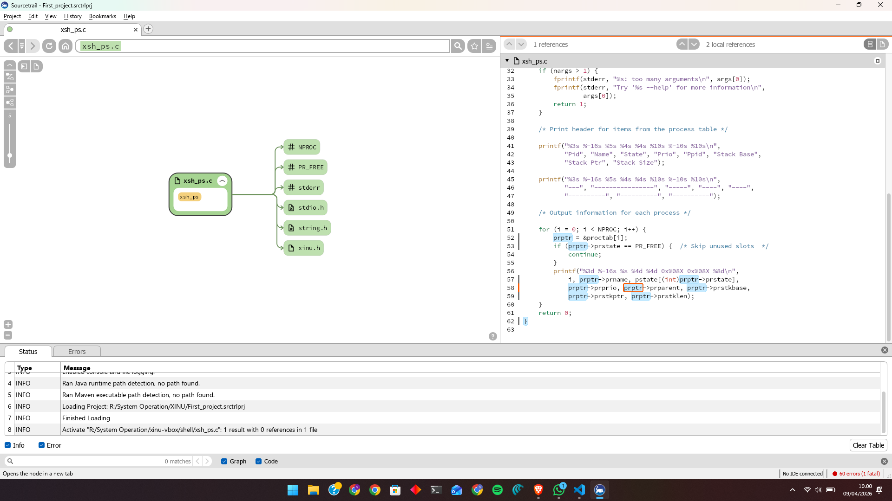
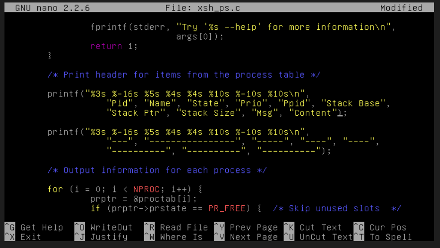
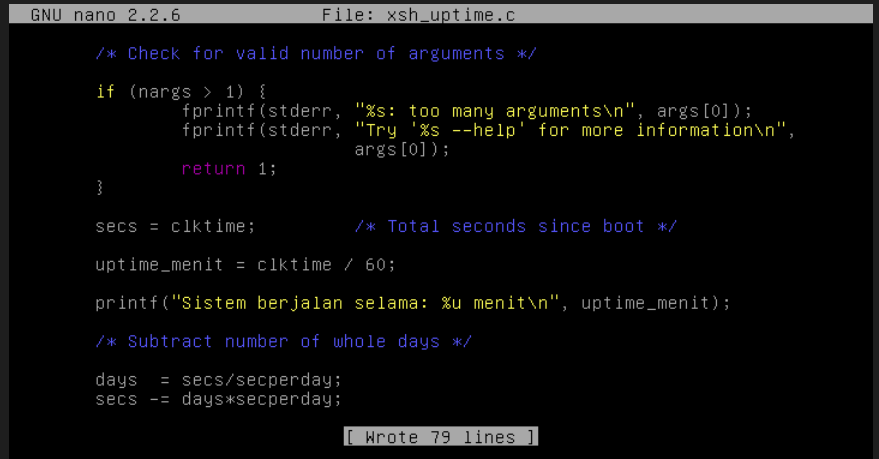

# <h1 align="center">Laporan Praktikum Modul 05  Eksplorasi Proses Xinu</h1>

Satria Ramadhan - 2311104026

## Dasar Teori

> Sistem operasi Xinu mengelola seluruh aktivitas proses melalui struktur data pusat yang disebut tabel proses, di mana setiap proses yang berjalan direpresentasikan sebagai satu entri unik di dalamnya. Komponen inti dari entri ini adalah Process Control Block (PCB), yaitu sebuah struktur data kernel yang menyimpan informasi krusial seperti status proses (state), prioritas, dan stack pointer. Dalam implementasi Xinu, tabel proses ini diwujudkan sebagai sebuah global array bernama proctab yang menggunakan struktur procent (Process Entry). Hal unik pada Xinu adalah penggunaan identitas proses (PID) secara implisit, di mana nomor PID sebuah proses ditentukan langsung berdasarkan indeks entri tersebut di dalam array proctab, bukan melalui variabel ID yang disimpan secara eksplisit. Melalui pemahaman PCB ini, praktikan diharapkan mampu melakukan modifikasi operasional sistem, seperti menambahkan kolom informasi pesan pada perintah ps atau mengubah format tampilan waktu pada perintah uptime.

## Guided

1. [10 Poin] Jawablah pertanyaan berikut ini:

   <ol type="a">
      <li>Berapa banyaknya maksimum proses yang ada pada Xinu? 50 proses</li>
      <li>Berapa maksimal panjang nama suatu proses pada Xinu? 16 karakter</li>
      <li>Berapa nilai prioritas awal pada saat proses dibuat? Pas proses baru dibuat (pakai create), kalau pakai nilai default biasanya prioritasnya itu 20.</li>
      <li>Ada berapa total state pada Xinu? Sebutkan! ada 9 state yaitu: PR_FREE, PR_CURR, PR_READY, PR_RECV, PR_SLEEP, PR_SUSP, PR_WAIT, PR_RECTIM, dan PR_SEND</li>
   </ol>

2. [20 Poin] Perintah ps adalah perintah untuk menampilkan statistik process yang berjalan. Source code dari ps tersimpan pada file xsh_ps.c. Carilah file tersebut dan beri komentar pada 20 baris terakhir di source code tersebut!
   

3. [35 Poin] Ubahlah perintah ps (source code: xsh_ps.c) pada Xinu sehingga menampilkan informasi tambahan berupa kolom yang berisi total message yang ada pada proses seperti gambar di bawah ini:

> - Masuk ke Xinu/shell cari xsh_ps.c
> - ubah pada bagian:
>   
>   Kompilasi ulang xinu

4. [35 Poin] Ubahlah perintah uptime pada Xinu sehingga menampilkan lamanya Xinu sejak booting hanya dalam satuan menit.

> Buka xsh_uptime.c
> Modifikasi file
> 
> setelah itu kompilasi ulang xinu

## Referensi

1. [Modul Sistem Operasi](https://telkomuniversityofficial-my.sharepoint.com/personal/maghaz_student_telkomuniversity_ac_id/_layouts/15/onedrive.aspx?id=%2Fpersonal%2Fmaghaz%5Fstudent%5Ftelkomuniversity%5Fac%5Fid%2FDocuments%2F2026%2F00%2E%20Modul%20Praktikum%20Sistem%20Operasi%20SE%202526%2D2%2Epdf&parent=%2Fpersonal%2Fmaghaz%5Fstudent%5Ftelkomuniversity%5Fac%5Fid%2FDocuments%2F2026&ga=1)
