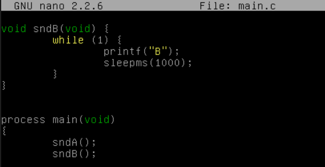
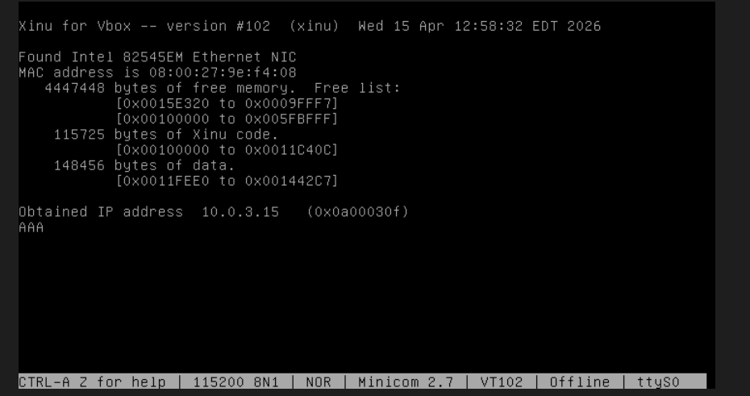
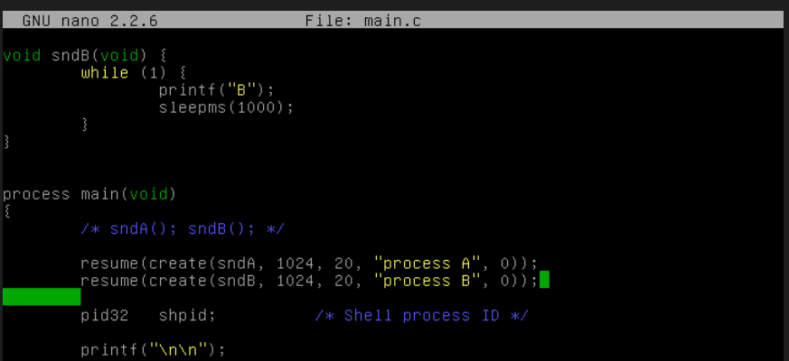
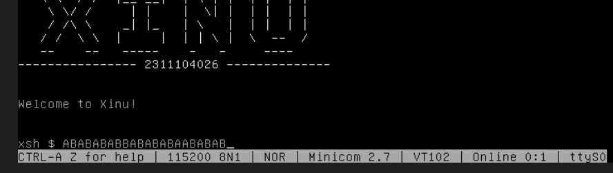

# <h1 align="center">Laporan Praktikum Modul 06<br> Proses Sekuensial dan Konkuren</h1>

<p align="center">Satria Ramadhan - 2311104026</p>

## Dasar Teori

> Konsep dasar dalam sistem operasi membedakan antara eksekusi sekuensial, di mana instruksi dijalankan secara berurutan baris demi baris oleh satu proses tunggal, dengan eksekusi konkuren yang memungkinkan banyak komputasi berlangsung seolah-olah pada saat yang bersamaan. Dalam pemrograman sekuensial, sebuah fungsi yang memiliki kalang tak berujung (infinite loop) akan menghambat eksekusi fungsi setelahnya karena kendali program tidak pernah dilepaskan, sedangkan dalam pemrograman konkuren, sistem operasi menggunakan teknik multitasking atau interleaving untuk menjadwalkan perpindahan antar-proses secara cepat. Pada sistem operasi Xinu, konkurensi dicapai dengan mengubah fungsi menjadi proses mandiri menggunakan system call create() dan resume(), sehingga setiap proses mendapatkan alokasi waktu eksekusinya sendiri dalam lingkungan timesharing atau real-time tanpa harus menunggu proses lain selesai sepenuhnya.

## Guided

1. [10 Poin] Selain hardware (memory), batasan maksimal proses dapat ditentukan dengan secara software. Pada Linux maksimal proses adalah 4194303 proses (64 bit) dan 32767 proses (32 bit) dapat dilihat melalui perintah $cat /proc/sys/kernel/pid_max. Carilah pada source code Xinu yang memberi batasan mengenai banyaknya proses yang bisa dibuat! Berapa maksimal proses dalam Xinu? Ubah menjadi maksimal 150 proses!

   > source code berada pada include/process.h
   > 

2. [20 Poin] Jalankan kode sekuensial!

   > Berikut adalah kode sekuensial, Pada skenario ini, kita akan melihat bagaimana fungsi yang berjalan terus-menerus (infinite loop) akan memblokir eksekusi instruksi selanjutnya.
   > 
   > dengan skenario ini, yang akan muncul hanyalah pada process A, dan akan memblokir proses B
   > 
   > program akan selalu menampilkan A pada keadaan infinite loop.

3. [20 Poin] Jalankan kode konkuren!

   > Berikut adalah kode konkuren, pada skenario ini kita menggunakan systemcall `create`, untuk membuat proses baru sehingga fungsi-fungsi tersebut dapat berjalan secara "bersamaan"
   > 
   > shell akan menampilkan process A, dan B secara bergantian 'AB'
   > 

4. [50 Poin] Buatlah 2 proses produser dan konsumer. Produser memproduksi angka integer dari 1-1000. Konsumer mengkonsumsi integer yang diproduksi oleh produser dan menampilkannya! (Gunakan variabel global bertipe int32 bernama n yang digunakan secara bersama oleh kedua proses)

   ```
   int32 n = 0; //global variabel

   void produser(void){
   int32 i;
   for (i=1; i<=1000; i++){
   n++;
   }
   }

   void konsumer(void){
   int32 i;
   for (i=1; i<=1000; i++){
       printf("Nilai dari n adalah %d\n",n);
   }
   }
   ```

   Hasil dari program ini cukup mengejutkan (tidak akan sesuai dengan intuisi awal). Jelaskan mengapa hasilnya seperti itu!

   > Hasil dari program produser-konsumer tersebut tidak akan sesuai dengan intuisi awal karena adanya fenomena Race Condition dan ketidakteraturan penjadwalan proses (Interleaving) oleh sistem operasi. Secara teoritis, kita mungkin mengharapkan angka tercetak berurutan dari 1 hingga 1000, namun pada kenyataannya, kedua proses tersebut berjalan secara konkuren dan berebut menggunakan variabel global n tanpa adanya mekanisme sinkronisasi seperti Semaphore. Karena Xinu menggunakan sistem penjadwalan preemptive, sistem operasi dapat menghentikan proses produser kapan saja—bahkan saat proses penambahan nilai n++ belum selesai sepenuhnya di tingkat bahasa mesin—untuk memberikan jatah waktu kepada proses konsumer. Akibatnya, proses konsumer mungkin akan mencetak nilai yang sama berulang kali jika ia berjalan lebih cepat, atau justru melewatkan banyak angka jika produser telah melakukan beberapa kali iterasi sebelum konsumer sempat mendapatkan giliran CPU, sehingga output yang dihasilkan tampak acak dan tidak sinkron.

## Referensi

1. [Modul Sistem Operasi](https://telkomuniversityofficial-my.sharepoint.com/personal/maghaz_student_telkomuniversity_ac_id/_layouts/15/onedrive.aspx?id=%2Fpersonal%2Fmaghaz%5Fstudent%5Ftelkomuniversity%5Fac%5Fid%2FDocuments%2F2026%2F00%2E%20Modul%20Praktikum%20Sistem%20Operasi%20SE%202526%2D2%2Epdf&parent=%2Fpersonal%2Fmaghaz%5Fstudent%5Ftelkomuniversity%5Fac%5Fid%2FDocuments%2F2026&ga=1)
