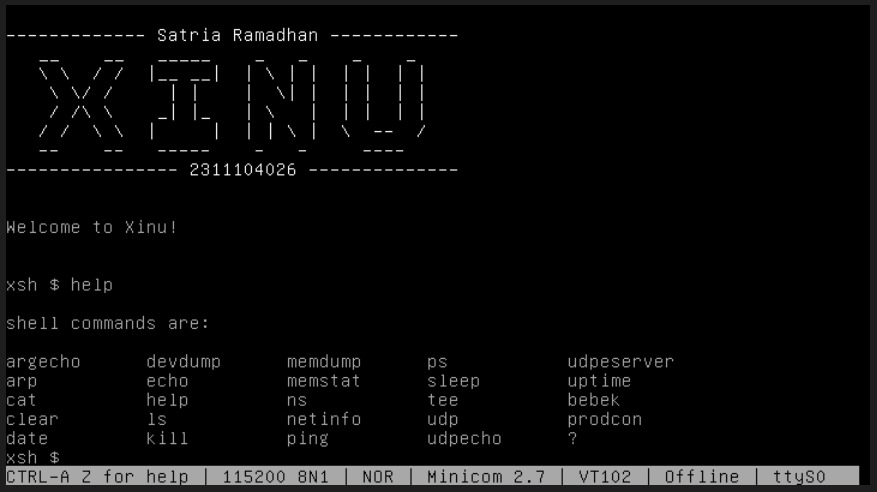
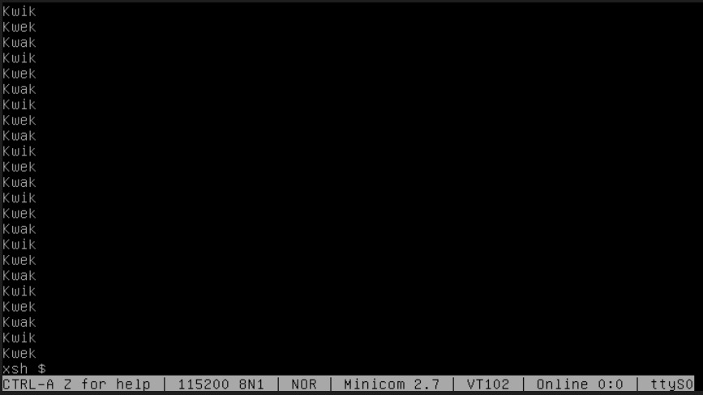
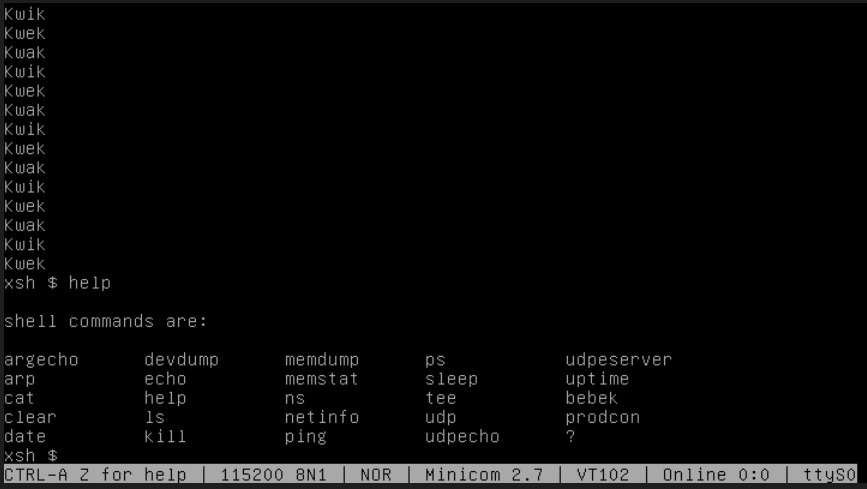
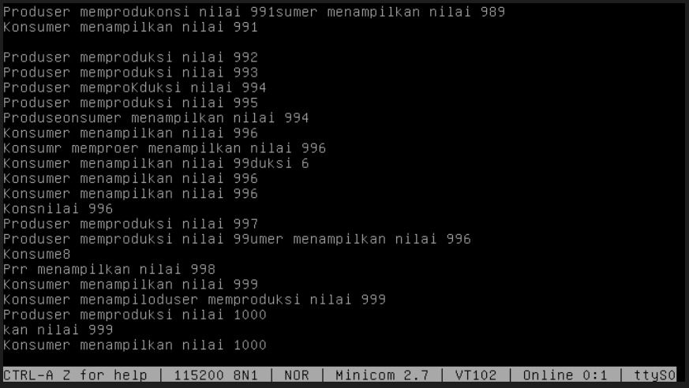

# <h1 align="center">Laporan Praktikum Modul 07  Semaphore</h1>

Satria Ramadhan - 2311104026

## Dasar Teori

> Semaphore merupakan sebuah mekanisme sinkronisasi yang digunakan dalam sistem operasi untuk mengatur akses proses-proses konkuren terhadap sumber daya bersama (shared resources) dan mengoordinasikan urutan eksekusi antar proses. Pada sistem operasi Xinu, semaphore dikelola melalui tiga operasi utama, yaitu inisiasi menggunakan semcreate() untuk menentukan nilai awal, signal() untuk menaikkan nilai semaphore (increment), dan wait() untuk menurunkan nilai semaphore (decrement) yang dapat menyebabkan sebuah proses berpindah ke status blocked jika nilai semaphore menjadi negatif. Secara praktis, semaphore sering diimplementasikan dalam dua pola utama: pola signaling yang menjamin urutan eksekusi tertentu antar proses agar tidak terjadi tumpang tindih logika, serta pola mutex (Mutual Exclusion) yang memastikan bahwa suatu bagian kritis (critical section) atau variabel global hanya dapat diakses oleh satu proses pada satu waktu guna mencegah terjadinya race condition.

## Guided

1.  [50 poin] Buatlah 3 buah proses yaitu P1, P2 dan P3. P1 selalu menampilkan “kwak”, P2 selalu menampilkan “kwik”, P3 selalu menampilkan “kwek”. Menggunakan 3 proses tersebut dan beberapa buah semaphore, buatlah program yang dapat menampilkan:
    Kwak
    Kwik
    Kwek
    Kwak
    Kwik
    Kwek

    > Berikut adalah hasil dari proses
    > 
    > 

2.  [50 poin] Buatlah proses bernama produser yang memproduksi bilangan 1-1000. Buatlah proses bernama konsumer yang akan menampilkan nilai yang diproduksi oleh produser. Gunakan semaphore!
    Produser memproduksi nilai 1
    Konsumer menampilkan nilai 1
    Produser memproduksi nilai 2
    Konsumer menampilkan nilai 2
    Produser memproduksi nilai 1000
    Konsumer menampilkan nilai 1000
    > 
    > 

## Referensi

1. [Modul Sistem Operasi](https://telkomuniversityofficial-my.sharepoint.com/personal/maghaz_student_telkomuniversity_ac_id/_layouts/15/onedrive.aspx?id=%2Fpersonal%2Fmaghaz%5Fstudent%5Ftelkomuniversity%5Fac%5Fid%2FDocuments%2F2026%2F00%2E%20Modul%20Praktikum%20Sistem%20Operasi%20SE%202526%2D2%2Epdf&parent=%2Fpersonal%2Fmaghaz%5Fstudent%5Ftelkomuniversity%5Fac%5Fid%2FDocuments%2F2026&ga=1)
