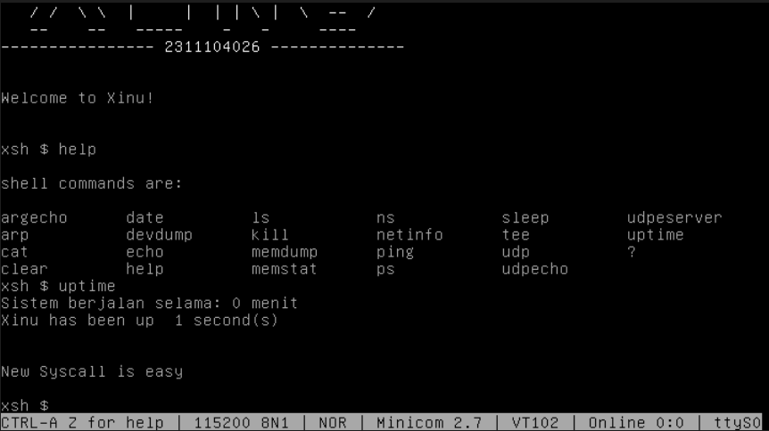
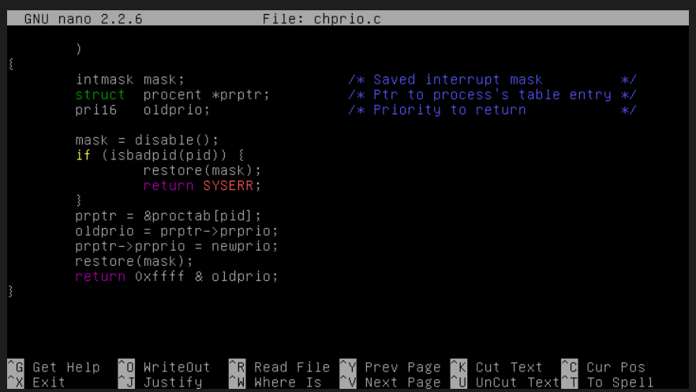
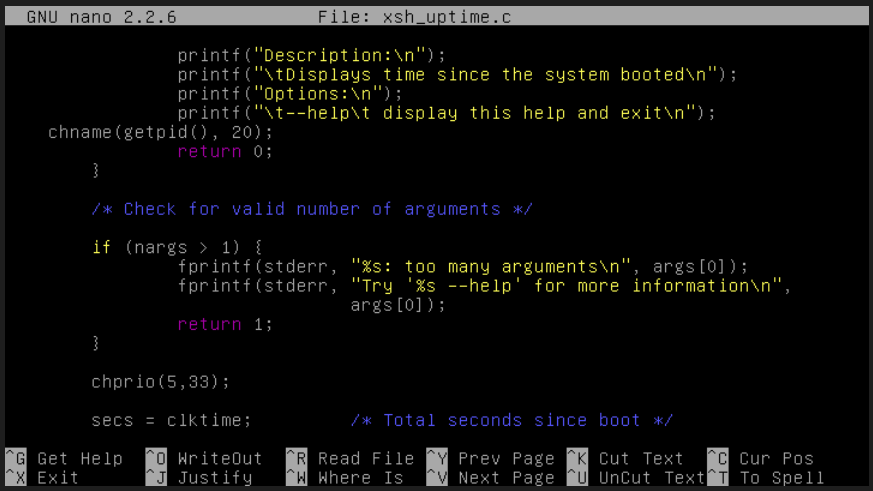
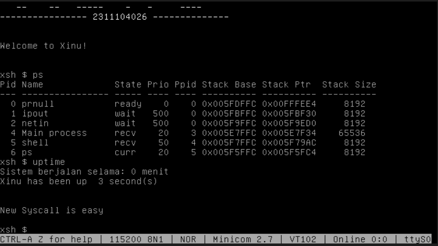
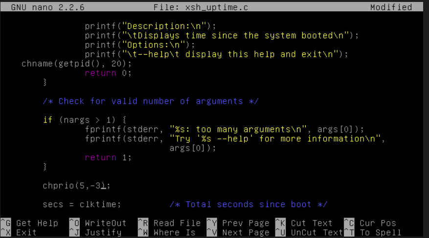
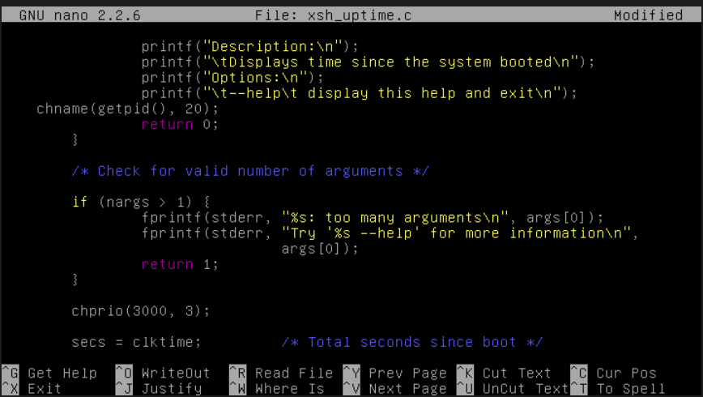

# <h1 align="center">Laporan Praktikum Modul 09  Syscall</h1>

Satria Ramadhan - 2311104026

## Dasar Teori

> System call atau syscall merupakan mekanisme penting dalam sistem operasi yang berfungsi sebagai antarmuka (interface) antara proses di level user dengan kernel sistem operasi. Melalui syscall, sebuah proses dapat meminta layanan yang hanya dapat dijalankan oleh kernel, seperti manajemen memori, pengelolaan proses, dan operasi input/output. Dalam konsep sistem operasi, syscall juga berperan sebagai bentuk abstraksi dan proteksi sistem. Proses pengguna tidak diperbolehkan mengakses sumber daya hardware secara langsung, melainkan harus melalui syscall. Hal ini bertujuan untuk menjaga keamanan serta konsistensi sistem. Dengan demikian, proses tidak perlu mengetahui implementasi internal kernel, cukup memanggil syscall yang tersedia dan menerima hasilnya berupa status keberhasilan atau kegagalan. Syscall berbeda dengan fungsi biasa yang dibuat oleh developer, seperti printf(). Fungsi seperti printf() sebenarnya adalah bagian dari library di user space, yang pada akhirnya dapat memanggil syscall untuk melakukan operasi nyata, seperti menampilkan output ke layar.

## Unguided

1.  [50 Poin] Buat syscall baru seperti yang ditunjukkan pada modul syscall poin 9.5! (sertakan Screenshot kode dan hasil run)
    > 

2.  [25 Poin] Perbaiki syscall chprio (xinu/system/chprio.c) dengan memperhatikan validasi input
    Pastikan id adalah angka dari 0 – NPROC (ukuran maks banyaknya proses)
    Pastikan prioritas adalah bilangan yang positif
    Compile dan jalankan Xinu dengan syscall yang telah diperbaiki make clean make

    > 

3. [25 Poin] Testing chprio syscall yang telah diubah
    > 
    > 
    > 
    > 

## Referensi

1. [Modul Sistem Operasi](https://telkomuniversityofficial-my.sharepoint.com/personal/maghaz_student_telkomuniversity_ac_id/_layouts/15/onedrive.aspx?id=%2Fpersonal%2Fmaghaz%5Fstudent%5Ftelkomuniversity%5Fac%5Fid%2FDocuments%2F2026%2F00%2E%20Modul%20Praktikum%20Sistem%20Operasi%20SE%202526%2D2%2Epdf&parent=%2Fpersonal%2Fmaghaz%5Fstudent%5Ftelkomuniversity%5Fac%5Fid%2FDocuments%2F2026&ga=1)
