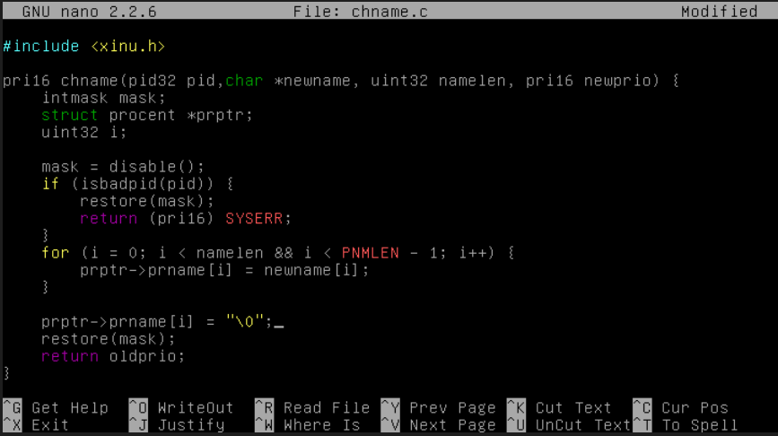
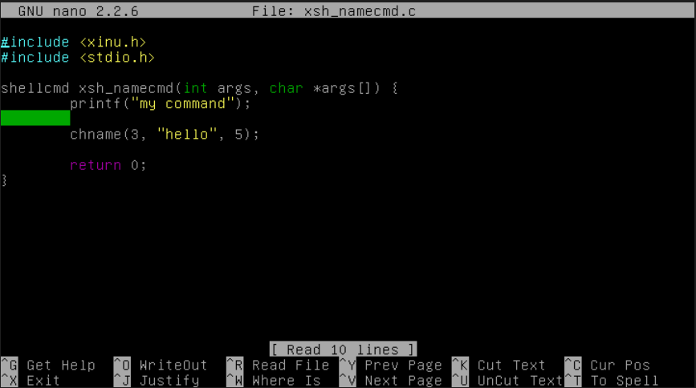
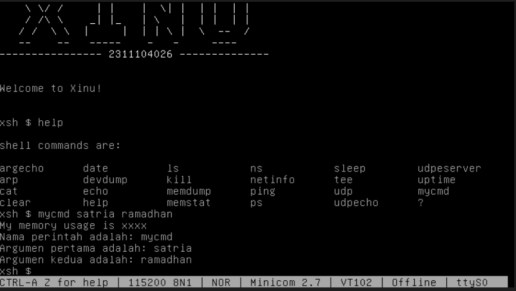

# <h1 align="center">Laporan Praktikum Modul 10  Shell</h1>

Satria Ramadhan - 2311104026

## Dasar Teori

> Shell merupakan program antarmuka yang berfungsi sebagai penerjemah perintah antara pengguna dengan sistem operasi, di mana pengguna tidak secara langsung memanggil system call (syscall) yang disediakan kernel, melainkan melalui shell sebagai command interpreter. Syscall sendiri adalah layanan inti sistem operasi yang memungkinkan program mengakses sumber daya seperti proses, memori, dan perangkat input/output secara aman. Pada Xinu, shell bekerja dengan cara membaca input perintah dari terminal secara berulang, kemudian melakukan parsing untuk memisahkan nama perintah dan argumen yang diberikan, lalu mencocokkannya dengan daftar command yang tersimpan pada struct cmdent cmdtab[] di file shell.c. Berbeda dengan sistem operasi Linux yang command shell-nya berupa file executable di harddisk, seluruh command pada Xinu tertanam langsung di dalam image hasil kompilasi sehingga setiap penambahan atau pengurangan command harus dilakukan melalui modifikasi source code dan kompilasi ulang sistem. Untuk menambahkan command baru, programmer harus mendaftarkan nama command pada shell.c, menambahkan prototype fungsi pada shprototypes.h, serta membuat file implementasi command pada folder shell. Dengan demikian, praktikum shell Xinu memberikan pemahaman bahwa shell bukan hanya sekadar tempat mengetik perintah, tetapi merupakan penghubung utama antara input pengguna dengan fungsi-fungsi internal kernel sistem operasi.

## Unguided

1.  [40 Poin] Akan dimodifikasi shell dengan modifikasi syscall bernama chname yang
    berfungsi untuk mengubah nama suatu proses. Lihat kembali modul sebelumnya cara
    membuat syscall.

    > 

2.  [40 Poin] Buatlah perintah baru bernama namecmd sesuai dengan langkah-langkah pada
    no.5 pada modul shell!
    Berikut adalah kode dalam perintah baru namecmd:

    > 

3.  [20 Poin] Test hasilnya:
    a. Masuk ke terminal xinu
    b. Jalankan perintah ps
    c. Jalankan perintah namecmd
    d. Jalankan perintah ps
    e. Lihat nama proses telah berubah > 

## Referensi

1. [Modul Sistem Operasi](https://telkomuniversityofficial-my.sharepoint.com/personal/maghaz_student_telkomuniversity_ac_id/_layouts/15/onedrive.aspx?id=%2Fpersonal%2Fmaghaz%5Fstudent%5Ftelkomuniversity%5Fac%5Fid%2FDocuments%2F2026%2F00%2E%20Modul%20Praktikum%20Sistem%20Operasi%20SE%202526%2D2%2Epdf&parent=%2Fpersonal%2Fmaghaz%5Fstudent%5Ftelkomuniversity%5Fac%5Fid%2FDocuments%2F2026&ga=1)
