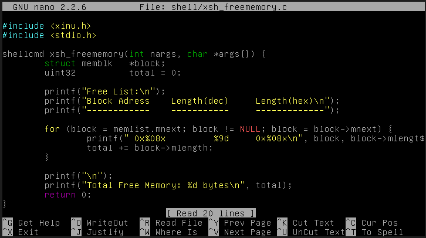
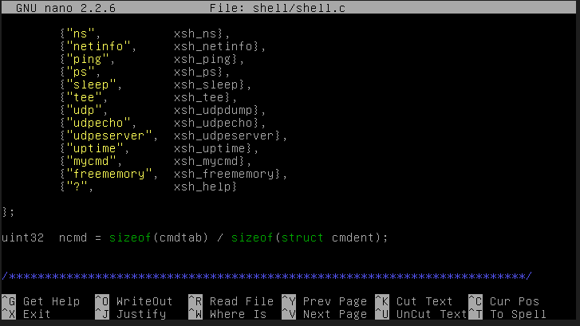
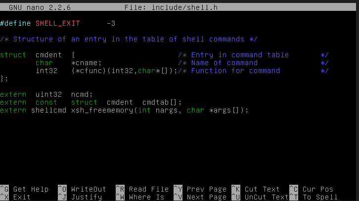
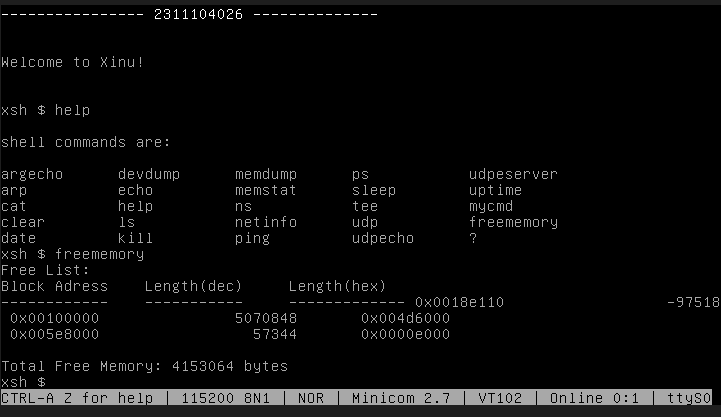

# <h1 align="center">Laporan Praktikum Modul 11  Memori Xinu</h1>

Satria Ramadhan - 2311104026

## Dasar Teori

> Memori pada sistem operasi Xinu dikelola menggunakan mekanisme dynamic memory allocation yang membagi memori menjadi beberapa segmen, yaitu text segment (kode program), data segment (variabel global yang telah diinisialisasi), BSS segment (variabel global yang belum diinisialisasi), stack, dan heap. Xinu menggunakan struktur linked list bernama memlist untuk melacak blok-blok memori yang bebas (free memory blocks), di mana setiap blok menyimpan informasi ukuran (mlength) dan pointer ke blok berikutnya (mnext). Manajemen memori ini memungkinkan Xinu mengalokasikan memori secara dinamis melalui fungsi getmem() dan membebaskannya kembali melalui freemem(), sehingga sistem dapat mengelola sumber daya memori secara efisien selama eksekusi berlangsung.

## Unguided

1.  [80 poin] Buatlah perintah baru bernama freememory yang memiliki dua fungsi berikut:
    a. [40 poin] Menampilkan seluruh free memory block yang tercatat dalam free memory
    list pada Xinu.
    b. [40 poin] Menghitung dan menampilkan total ukuran free memory berdasarkan
    seluruh block yang ada pada list tersebut.

    > buat perintah freememory
    > 
    > daftarkan perintah pada shell
    > shell/shell.c
    > 
    > include/shell.h
    > 
    > Compile-> make clean->make->sudo minicom-> jalankan perintah freememory
    > 

2.  [4 poin per subsoal] Jawablah pertanyaan berikut:  
    **a. Mengapa Xinu memisahkan data segment dan BSS segment?**

    > Xinu memisahkan data segment dan BSS segment untuk efisiensi penyimpanan. Data segment menyimpan variabel global yang sudah diinisialisasi sehingga nilainya harus ada di file binary, sedangkan BSS segment menyimpan variabel yang belum diinisialisasi (bernilai nol) sehingga tidak perlu disimpan di binary — cukup dicatat ukurannya dan di-zero-fill saat loading. Hal ini menghemat ukuran file executable secara signifikan.

    **b. Bagaimana alokasi dan dealokasi memori selama eksekusi memengaruhi ukuran free space?**

    > Alokasi memori (`getmem()`) akan mengurangi ukuran free space karena blok diambil dari free memory list. Sebaliknya, dealokasi (`freemem()`) akan menambah free space karena blok dikembalikan ke list. Xinu juga melakukan coalescing (penggabungan blok bersebelahan) untuk mencegah fragmentasi. Jika terjadi memory leak, free space akan terus berkurang hingga sistem kehabisan memori.

    **c. Mengapa penggunaan heap lebih berpotensi menimbulkan masalah dibandingkan stack?**

    > Heap dikelola secara manual oleh programmer, sehingga rentan terhadap memory leak (lupa `freemem()`), double free, dan dangling pointer. Selain itu, heap rentan mengalami fragmentasi eksternal. Berbeda dengan stack yang dikelola otomatis oleh sistem dan dibebaskan saat fungsi selesai, sehingga tidak ada risiko lupa membebaskan memori.

    **d. Mengapa Xinu menggunakan struktur linked list untuk menyimpan free block?**

    > Xinu menggunakan linked list karena jumlah free block bersifat dinamis (berubah saat runtime), sehingga linked list dapat tumbuh dan menyusut dengan fleksibel. Selain itu, linked list yang diurutkan berdasarkan alamat memudahkan proses coalescing (penggabungan blok bersebelahan). Metadata blok (`mnext` dan `mlength`) juga disimpan di dalam blok itu sendiri sehingga tidak membutuhkan struktur data eksternal tambahan.

    **e. Apa tantangan utama dalam penggunaan heap di Xinu?**

    > Tantangan utama penggunaan heap di Xinu adalah fragmentasi memori akibat alokasi dan dealokasi berulang dengan ukuran berbeda, tidak adanya garbage collection sehingga memory leak dapat terjadi, serta tidak adanya proteksi antar proses karena Xinu menggunakan single address space sehingga satu proses dapat merusak heap proses lain. Selain itu, bug terkait heap seperti dangling pointer dan double free sangat sulit untuk di-debug.

## Referensi

1. [Modul Sistem Operasi](https://telkomuniversityofficial-my.sharepoint.com/personal/maghaz_student_telkomuniversity_ac_id/_layouts/15/onedrive.aspx?id=%2Fpersonal%2Fmaghaz%5Fstudent%5Ftelkomuniversity%5Fac%5Fid%2FDocuments%2F2026%2F00%2E%20Modul%20Praktikum%20Sistem%20Operasi%20SE%202526%2D2%2Epdf&parent=%2Fpersonal%2Fmaghaz%5Fstudent%5Ftelkomuniversity%5Fac%5Fid%2FDocuments%2F2026&ga=1)
