# <h1 align="center">Laporan Praktikum Modul 13  Perintah Linux</h1>

Satria Ramadhan - 2311104026

## Dasar Teori

> Kompilasi merupakan proses penerjemahan kode sumber (source code) yang ditulis dalam bahasa pemrograman tingkat tinggi, seperti C, menjadi kode mesin atau file eksekusi yang dapat dijalankan oleh sistem operasi. Pada sistem operasi Linux, proses kompilasi umumnya dilakukan menggunakan GNU Compiler Collection (GCC), yang berfungsi untuk menerjemahkan, memeriksa kesalahan sintaks, dan menghasilkan program yang siap dieksekusi. Setelah berhasil dikompilasi, program dapat dijalankan melalui terminal menggunakan file executable yang dihasilkan. Selain itu, Linux menyediakan berbagai utilitas sistem dan pustaka standar yang memungkinkan program berinteraksi dengan sistem operasi, seperti membuka file, membaca data, dan menangani kesalahan yang terjadi selama eksekusi program.

## Unguided

1.  [10 Poin] Jelaskan dengan bahasa sendiri, apa itu Sistem Operasi?

    > Sistem operasi adalah perangkat lunak yang menjadi jembatan antara pengguna, aplikasi, dan hardware komputer. Tanpa sistem operasi, program aplikasi seperti browser atau game tidak akan bisa berjalan karena tidak ada yang mengatur komunikasi antara software dan hardware.

2.  [7 Poin] Perintah pertama

    **a. Jalankan dan screenshot perintah berikut ini: ls**

    > 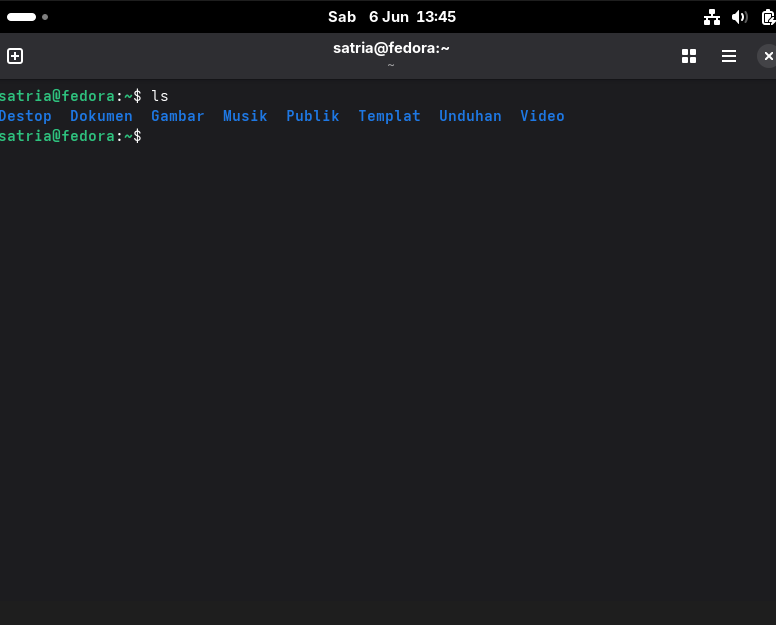

    **b. Apakah option dan parameter dari perintah di atas?**

    > perintah tidak ada option maupun parameter

    **c. Apa fungsi dari perintah tersebut?**

    > Fungsi perintah ini adalah melihat semua folder yang ada pada directory saat ini.

    **d. Jalankan perintah berikut ini: ls -al /**

    > 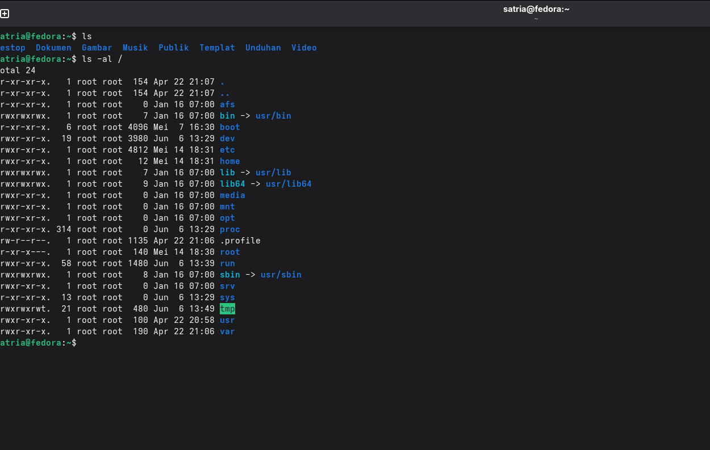

    **e. Apakah option dan parameter dari perintah di atas?**

    > option dari perintah tersebut adalah -al dengan parameter /

    **f. Apa fungsi dari perintah tersebut?**

    > fungsi ini menampilkan detail dari semua file termasuk semua file tersembunyi, dan parameter / memperintahkan untuk menampilkan file pada directory root

    **g. Jelaskan mengapa perintah pada a dan e mempunyai hasil yang berbeda!**

    > perintah pertama adalah untuk melihat semua folder yang ada pada directory saat ini, lalu perintah kedua untuk menampilkan folder dan file tersembunyi dan juga detail dari file tersebut pada directory root (/)

3.  [6 Poin] Pohon file

    **a. Jalankan dan screenshot perintah: pwd**

    > 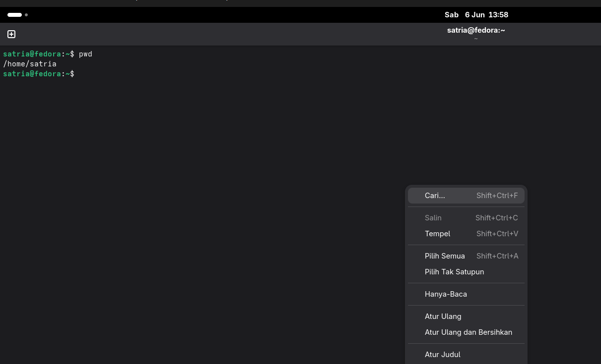

    **b. Apakah option dan parameter dari perintah tersebut?**

    > tidak ada option maupun parameter

    **b.Apa fungsi perintah tersebut?**

    > fungsi tersebut untuk mengetahui alamat/path kita saat ini yang dimana berada pada path /home/satria

4.  [6 Poin] Perpindahan

    **a. Jalankan dan screenshot perintah: cd /**

    > 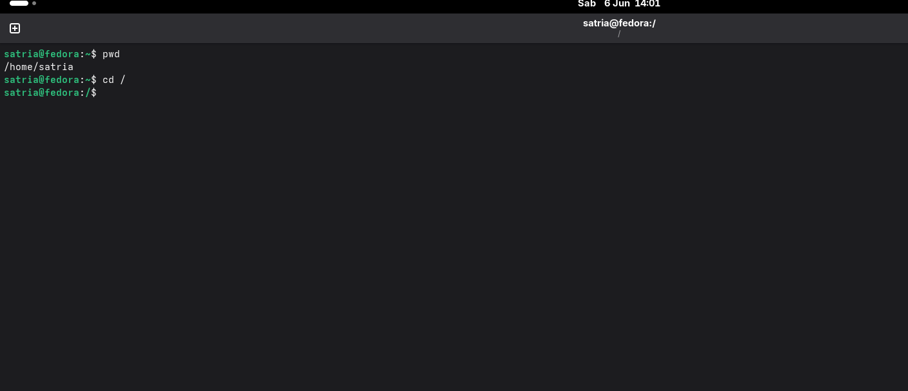

    **b. Apakah option dan parameter dari perintah tersebut?**

    > tidak ada option, namun ada parameter / yang dimana untuk mengarahkan ke dalam path root (/)

    **c. Apa yang dilakukan perintah tersebut?**

    > perintah ini adalah untuk switch/berpindah ke path lain

5.  [6 Poin] Direktori khusus

    **a. Lakukan dan screenshot perintah cd / kemudian lakukan perintah cd ~. Jelaskan hasil dari keduanya!**

    > 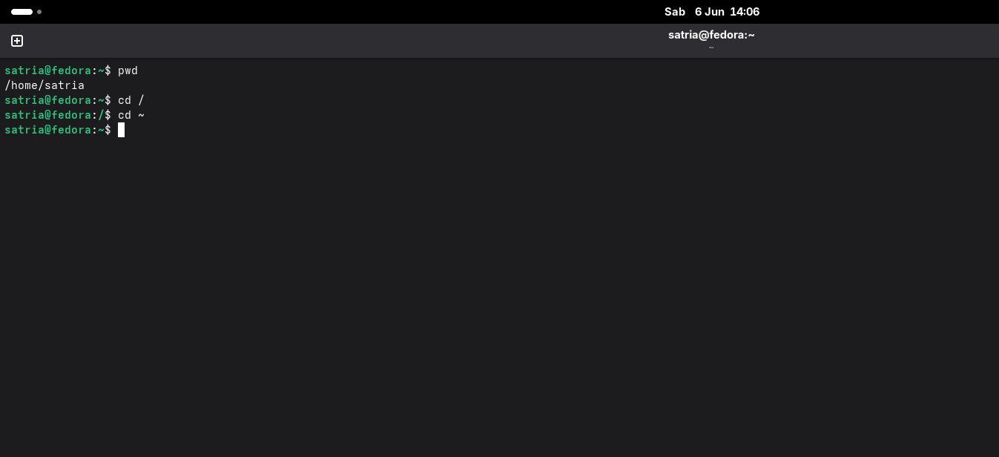
    > perintah cd / adalah perintah untuk berpindah path ke dalam directory /, dan cd ~ adalah perintah untuk berpindah ke directory ~

    **b. Lakukan perintah cd /proc/self.**

    > 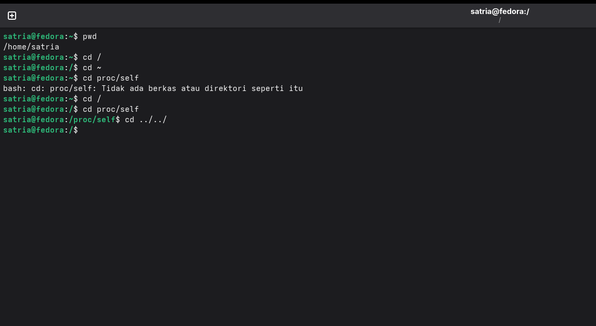
    > dengan menggunakan perintah cd ../../ akan kembali ke dalam directory /. Jadi kurang lebih 2 kali pemanggilan ..

6.  [14 Poin] Copy, rename dan delete file (screenshot setiap tahapan!)

    > 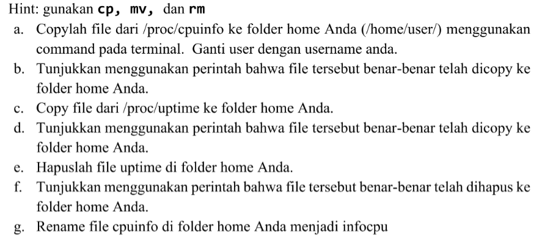
    > Semua pertanyaan a - g telah saya jawab melalui 1 screenshot dibawah ini
    > 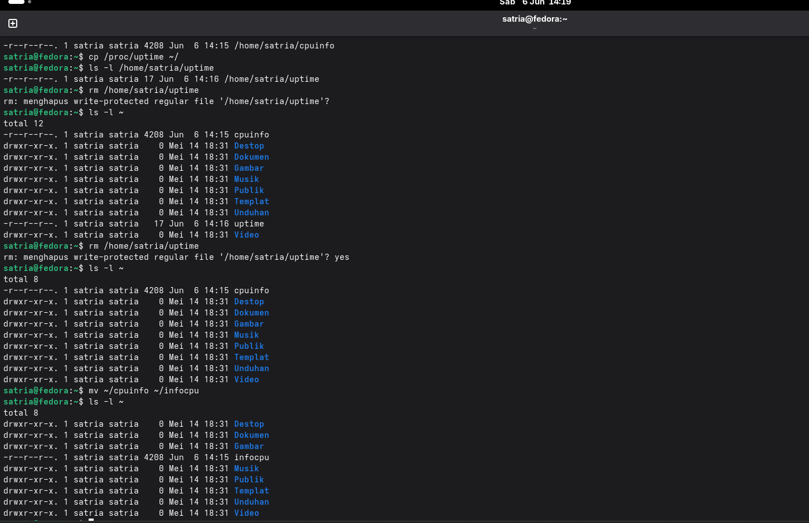

7.  [4 Poin] Membuat folder baru.

    > 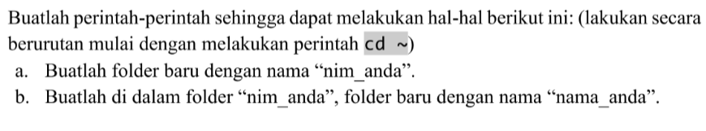
    > Berikut adalah hasil dari membuat folder baru:
    > 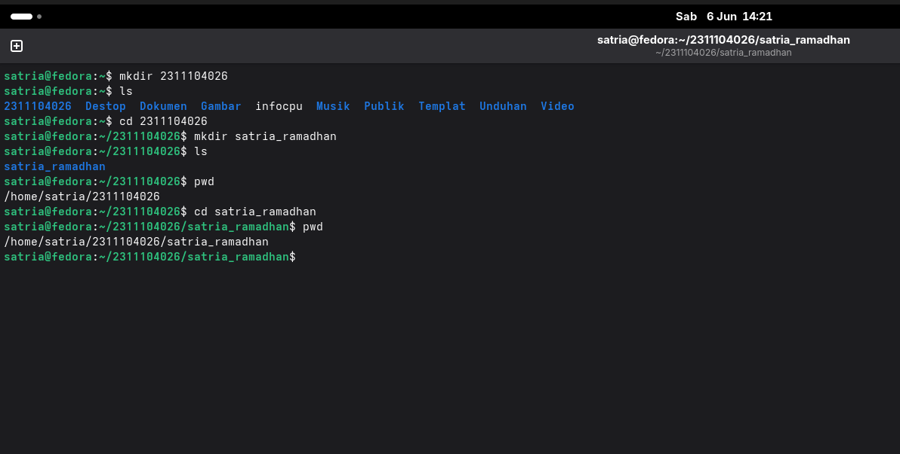

8.  [10 Poin] Membaca manual

    > 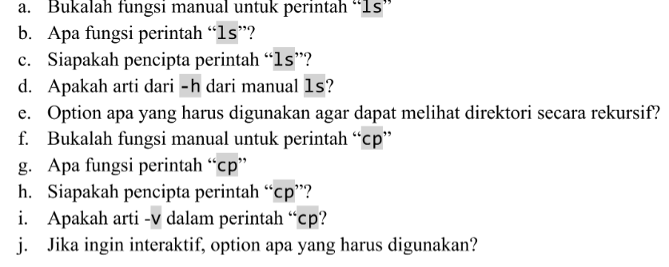
    > Berikut adalah jawabannya:  
    > **perintah ls**: Perintah ls digunakan untuk menampilkan daftar file dan direktori yang terdapat pada suatu lokasi di sistem operasi Linux. Berdasarkan manual ls, perintah ini merupakan bagian dari GNU Core Utilities yang ditulis oleh Richard M. Stallman dan David MacKenzie. Opsi -h (human-readable) digunakan untuk menampilkan ukuran file dalam format yang lebih mudah dibaca manusia, seperti KB, MB, atau GB. Selain itu, opsi -R (recursive) digunakan untuk menampilkan isi direktori beserta seluruh subdirektori yang ada di dalamnya secara rekursif. 
    > **perintah cp**: Perintah cp digunakan untuk menyalin file atau direktori dari satu lokasi ke lokasi lainnya. Berdasarkan manual cp, perintah ini ditulis oleh Torbjorn Granlund dan David MacKenzie sebagai bagian dari GNU Core Utilities. Opsi -v (verbose) digunakan untuk menampilkan informasi proses penyalinan yang sedang dilakukan, sedangkan opsi -i (interactive) digunakan untuk meminta konfirmasi kepada pengguna sebelum menimpa file yang sudah ada di lokasi tujuan.
    > 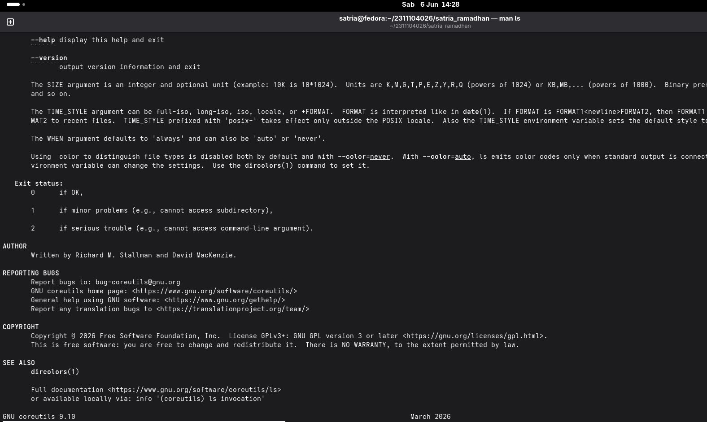
    > 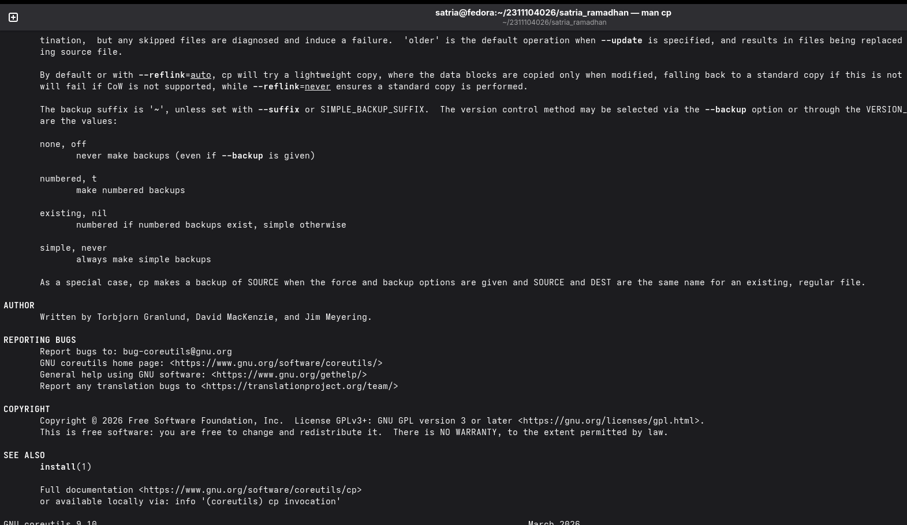

9.  [12 Poin] Pipe
    **a. Lakukan perintah ini cat /etc/passwd dan screenshot hasil perintah tersebut!**

    > 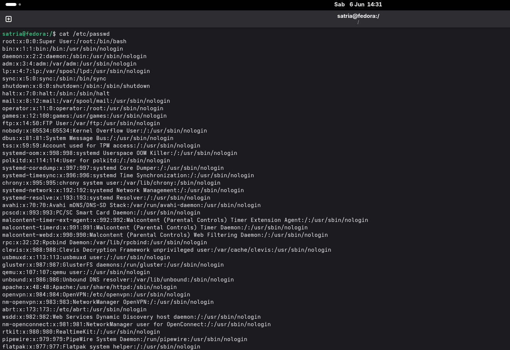

    **b. Apa fungsi perintah cat?**

    > melihat isi sebuah file

    **c. Lakukan perintah cat /etc/passwd | grep daemon dan screenshot hasil perintah tersebut!**

    > 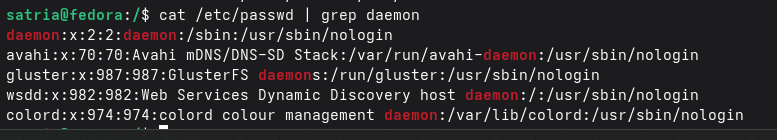

    **d. Lakukan perintah cat /etc/passwd | grep root dan screenshot hasil perintah tersebut!**

    > 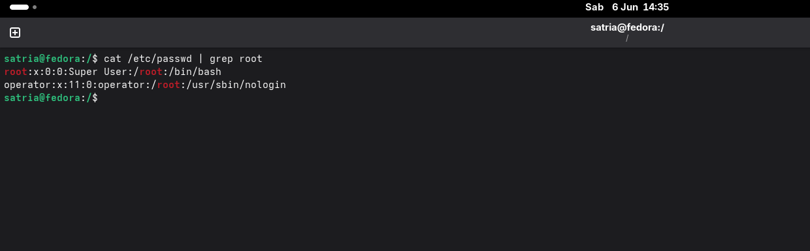

    **e.Lakukan perintah cat /etc/passwd | grep nobody dan screenshot hasil perintah tersebut!**

    > 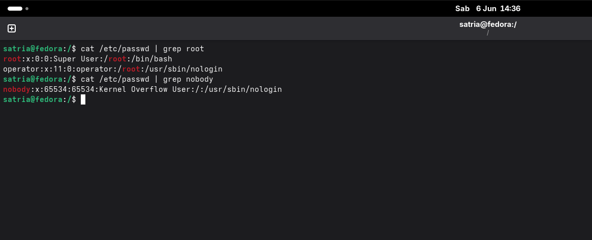

    **f. Apakah fungsi perintah “ | grep daemon”?**

    > Perintah | grep daemon digunakan untuk menyaring (filter) output dari perintah sebelumnya dan hanya menampilkan baris yang mengandung kata "daemon". Simbol | (pipe) mengirimkan hasil dari suatu perintah ke perintah grep, kemudian grep mencari teks yang sesuai. Contohnya pada ps -ef | grep daemon, hanya proses yang mengandung kata "daemon" yang akan ditampilkan.

10. [14 Poin] Redirection
    **a. Lakukan perintah dan jelaskan hasilnya cd / ls -al > /home/user/result.txt Ganti user dengan username ubuntu anda.**

    > 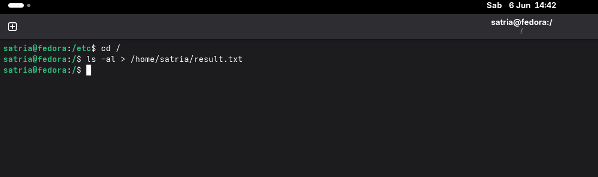

    **b. Dimana file result.txt berada?**

    > /home/satria/result.txt

    **c. Lakukan perintah dan jelaskan hasilnya cd / ls -al > /home/user/result.txt Ganti user dengan username ubuntu anda.**

    > 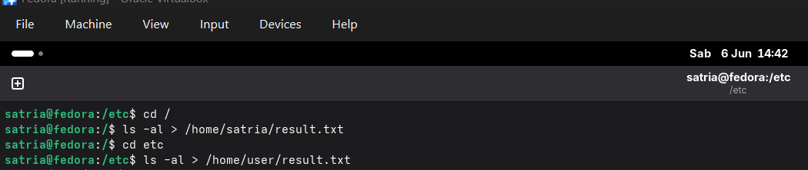

    **d. Apakah fungsi dari perintah >?**

    > Simbol > digunakan untuk mengalihkan output (redirection) ke sebuah file. Jika file belum ada maka akan dibuat, dan jika file sudah ada maka isi file akan ditimpa dengan output yang baru.

    **e. Lakukan perintah dan jelaskan hasilnya**

    > 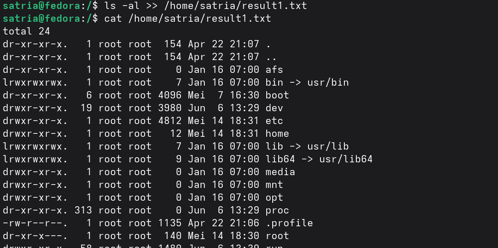
    > Perintah cd / digunakan untuk berpindah ke direktori root (/). Selanjutnya, perintah ls -al menampilkan seluruh isi direktori root secara detail, termasuk file tersembunyi, permission, pemilik, ukuran, dan waktu modifikasi. Simbol >> berfungsi untuk mengalihkan output ke file result1.txt dan menambahkan (append) hasil tersebut ke bagian akhir file. Jika file result1.txt belum ada, sistem akan membuatnya secara otomatis. Jika file sudah ada, isi sebelumnya tidak akan dihapus dan hasil baru akan ditambahkan di bawah isi yang sudah ada.

    **f. Lakukan perintah dan jelaskan hasilnya cd /etc ls -al >> /home/user/result1.txt**

    > 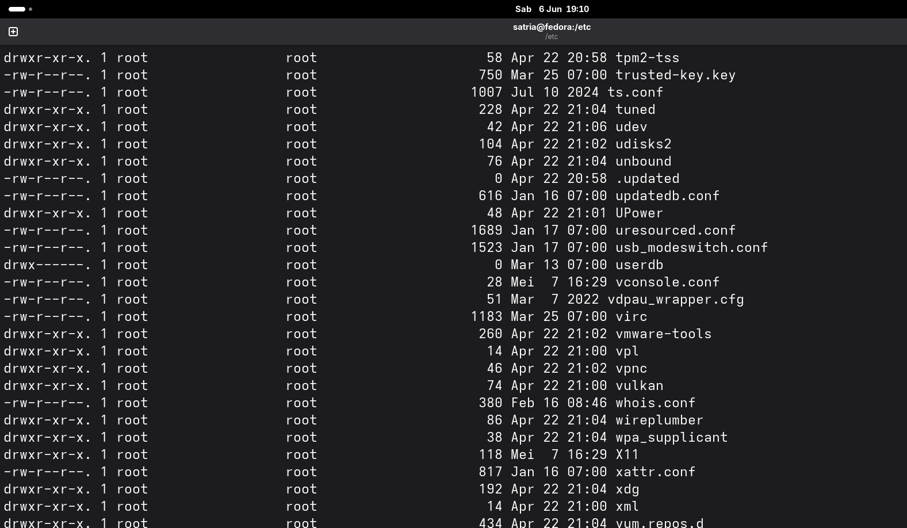
    > Perintah cd /etc digunakan untuk berpindah ke direktori /etc, yaitu direktori yang berisi berbagai file konfigurasi sistem Linux. Perintah ls -al kemudian menampilkan seluruh isi direktori tersebut secara detail. Simbol >> digunakan untuk mengalihkan output ke file result1.txt dengan cara menambahkan hasilnya ke akhir file. Dengan demikian, isi file yang sudah ada sebelumnya tetap dipertahankan, dan daftar isi direktori /etc akan ditambahkan di bawah data yang sudah tersimpan dalam result1.txt.

    **g. perbedaan > dan >>**

    > Perintah > dan >> sama-sama digunakan untuk redirection output ke file, tetapi memiliki fungsi yang berbeda. Simbol > digunakan untuk menulis output ke file dengan cara menimpa (overwrite) isi file yang sudah ada, sehingga data lama akan hilang dan diganti dengan output baru. Sementara itu, simbol >> digunakan untuk menambahkan (append) output ke bagian akhir file tanpa menghapus isi yang sudah ada sebelumnya. Dengan kata lain, > mengganti isi file, sedangkan >> menambahkan isi baru ke file yang sama.

11. Kompile Source Code (17point)
    1. Buatlah file dengan nama 2_1.c
       > 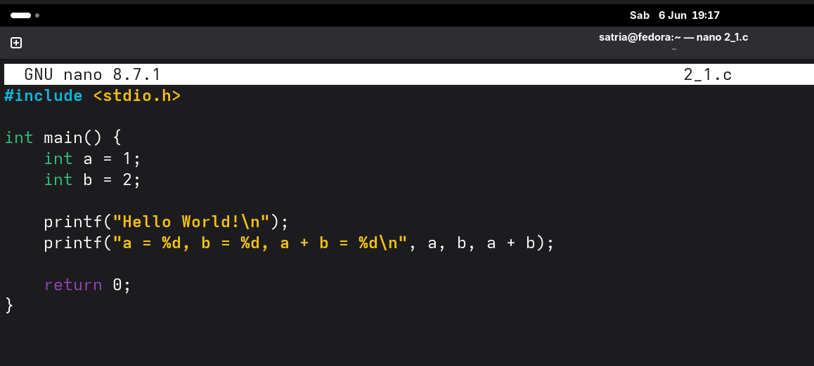
    2. Kompile source code tersebut menggunakan gcc! Nama output program adalah 2_1 (bukan a.out). Tuliskan perintah untuk mengkompile source code tersebut!
       > 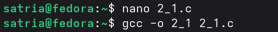
    3. Jalankan program yang baru saja Anda kompile. Tuliskan perintah untuk menjalankan program tersebut!
       > 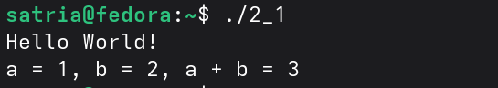
    4. Buatlah file dengan nama 2_2.c
       > 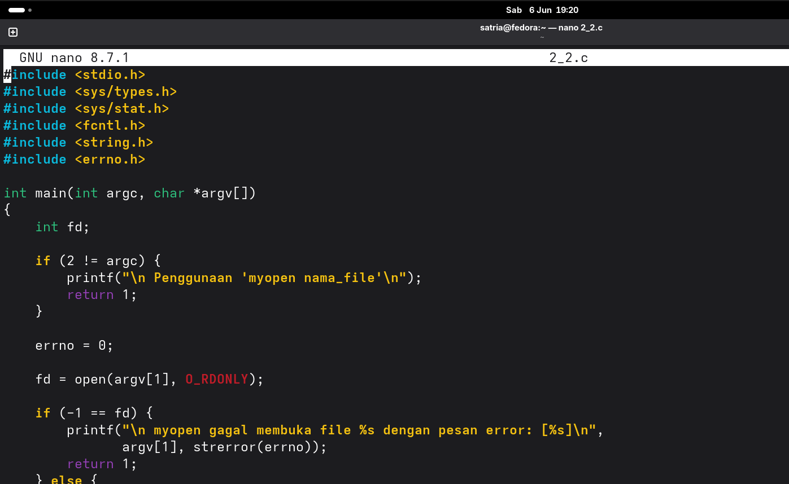
    5. Kompile source code tersebut menggunakan gcc! Nama output program adalah “myopen”. Tulis perintah untuk mengkompile source code tersebut.
       > 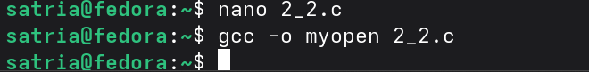
    6. Jalankan program myopen yang baru saja Anda buat! Tuliskan perintah untuk menjalankan program myopen.
       > 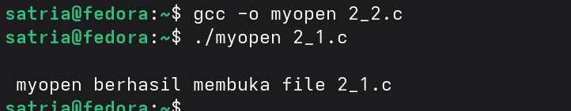
    7. Jelaskan apa yang dilakukan program tersebut!
       > Program myopen digunakan untuk mencoba membuka sebuah file yang diberikan melalui command line argument dalam mode baca (read only). Program akan memeriksa apakah pengguna memberikan nama file saat menjalankan program. Jika file berhasil dibuka, program akan menampilkan pesan bahwa file berhasil dibuka. Sebaliknya, jika file tidak ditemukan atau gagal dibuka, program akan menampilkan pesan error yang sesuai menggunakan fungsi strerror(errno) sehingga pengguna dapat mengetahui penyebab kegagalan tersebut.

## Referensi

1. [Modul Sistem Operasi](https://telkomuniversityofficial-my.sharepoint.com/personal/maghaz_student_telkomuniversity_ac_id/_layouts/15/onedrive.aspx?id=%2Fpersonal%2Fmaghaz%5Fstudent%5Ftelkomuniversity%5Fac%5Fid%2FDocuments%2F2026%2F00%2E%20Modul%20Praktikum%20Sistem%20Operasi%20SE%202526%2D2%2Epdf&parent=%2Fpersonal%2Fmaghaz%5Fstudent%5Ftelkomuniversity%5Fac%5Fid%2FDocuments%2F2026&ga=1)
