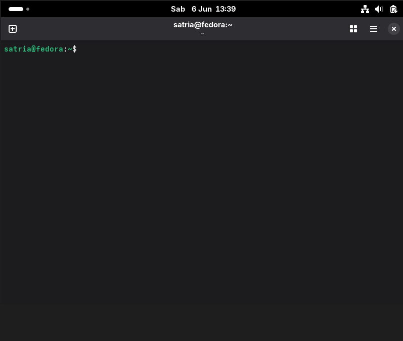
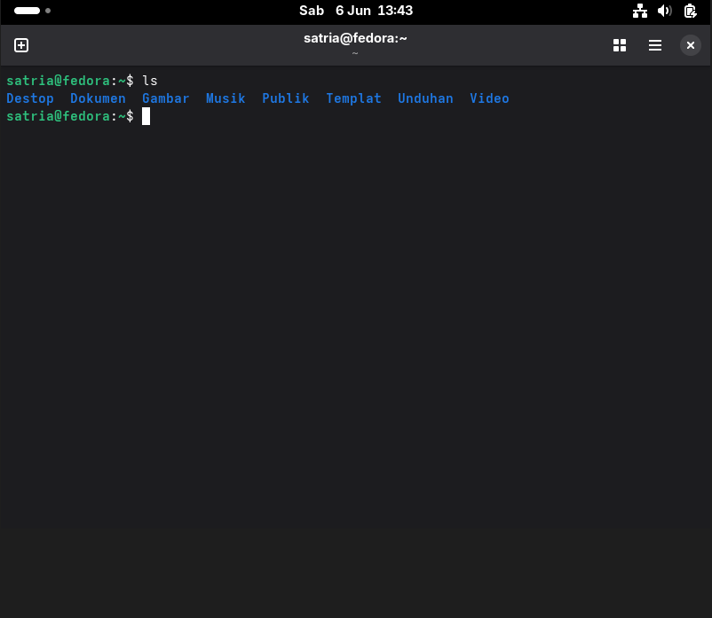

# <h1 align="center">Laporan Praktikum Modul 12  Linux dan Windows</h1>

Satria Ramadhan - 2311104026

## Dasar Teori

> Sistem operasi adalah komponen perangkat lunak dari sebuah sistem komputer yang bertanggung jawab untuk mengatur dan mengkoordinasikan aktivitas-aktivitas dan pembagian _resource_ komputer. Sistem operasi bertindak sebagai _host_ dari program aplikasi yang berjalan di mesin, menawarkan berbagai _service_ bagi program aplikasi dan pengguna melalui _application programming interfaces_ (API) atau _system calls_. Terdapat dua sistem operasi yang paling banyak digunakan saat ini, yaitu **Microsoft Windows** dan **Linux (Ubuntu)**. Microsoft Windows adalah sistem operasi berbasis GUI (_Graphical User Interface_) yang dikembangkan oleh Microsoft dan telah berevolusi dari MS-DOS sejak tahun 1985, dengan versi-versi mulai dari Windows 1.0 hingga Windows 10 dan seterusnya. Sementara itu, Linux adalah sistem operasi berbasis _open source_ yang dikembangkan dari kernel Linux oleh Linus Torvalds, dengan salah satu distribusi paling populer adalah Ubuntu yang dirilis pertama kali pada tahun 2004 dan dikenal karena kemudahan penggunaannya serta dukungan komunitas yang luas. Perbedaan utama antara keduanya terletak pada lisensi (proprietary vs open source), antarmuka, manajemen paket, keamanan, dan target penggunanya, sehingga pemahaman terhadap kedua sistem operasi ini menjadi penting bagi praktisi di bidang teknologi informasi.

## Unguided

1.  [5 point] Terminal 
    a. Jalankan dan screenshot terminal Anda! 

    > Sistem operasi adalah perangkat lunak yang menjadi jembatan antara pengguna, aplikasi, dan hardware komputer. Tanpa sistem operasi, program aplikasi seperti browser atau game tidak akan bisa berjalan karena tidak ada yang mengatur komunikasi antara software dan hardware.
    > 

    b. Jelaskan arti dari command prompt milik Anda!

    > Arti command prompt satria@fedora:~$ : satria adalah nama pengguna, yang berada pada host fedora pada directory ~, $ menandakan user ini user biasa (bukan root)

2.  [7 Poin] Perintah pertama
    

    **a. Jalankan dan screenshot perintah berikut ini: ls**

    > 

    **b. [5 Poin] Berapa bit Windows yang diinstall?**

    > 64 bit

    **c. [5 Poin] Berapa kecepatan processor yang digunakan?**

    > 4 processor

    **d. [5 Poin] Grafik yang digunakan versi berapa? Apakah sudah sesuai dengan spesifikasi rekomendasi pada modul?**

    > ya, sudah sesuai

3.  [10 Poin] Apa kelebihan dari windows yang terpasang sekarang? Sebutkan versi
    berapa windows terbaru saat ini!

    > Banyak yang bilang windows 10 itu, windows terbaik setelah windows 7. Yang dimana banyak pengguna yang lebih memilih menggunakan windows 10 daripada windows 11 yang secara performa windows 10 terbilang lebih baik. Windows saat ini sedang mengembangkan Windows 12

4.  [25 Poin] Buka virtualbox, dan jawab pertanyaan berikut!

    **a. [5 Poin] Linux apakah yang diinstall?**

    > Fedora Workstation
    > 

    **b. [5 Poin] Berapa bit Linux yang diinstall?**

    > 64bit

    **c. [5 Poin] Berapa ukuran hard disk virtual mesin?**

    > 25GB

    **d. [5 Poin] Terdapat berapa buah partisi pada hard disk?**

    > 3 partisi dengan alokasi: EFI system, Boot Partition, dan root partition

5.  [10 Poin] Linux memiliki berbagai jenis, sebutkan 5 jenis linux distro!

    > Ubuntu, Mint, Fedora, Arch, Kali, PopOs, SteamOs

6.  [10 Poin] Anda sudah mengenal dan menggunakan 3 jenis sistem operasi pada
    praktikum ini, sebutkan sistem operasi tersebut!

    > Windows, Linux, Xinu

7.  [10 Poin] Setelah mengenal 3 jenis sistem operasi tersebut, menurut Anda sistem
    operasi mana yang lebih mudah digunakan? Jelaskan argumentasi Anda!
    > Saya prefer ke Linux dengan menggunakan Ubuntu, dengan interface yang mudah dan smooth lalu juga dengan update yang masih rajin berjalan. Akan tetapi untuk penggunaan yang umum saya lebih prefer ke windows dengan dukungan yang melebihi dari kedua os tersebut.

## Referensi

1. [Modul Sistem Operasi](https://telkomuniversityofficial-my.sharepoint.com/personal/maghaz_student_telkomuniversity_ac_id/_layouts/15/onedrive.aspx?id=%2Fpersonal%2Fmaghaz%5Fstudent%5Ftelkomuniversity%5Fac%5Fid%2FDocuments%2F2026%2F00%2E%20Modul%20Praktikum%20Sistem%20Operasi%20SE%202526%2D2%2Epdf&parent=%2Fpersonal%2Fmaghaz%5Fstudent%5Ftelkomuniversity%5Fac%5Fid%2FDocuments%2F2026&ga=1)
