# <h1 align="center">Laporan Praktikum Modul 14  Scripting</h1>

Satria Ramadhan - 2311104026

## Dasar Teori

> Shell Script merupakan kumpulan perintah Linux yang ditulis dalam sebuah file teks dan dieksekusi secara berurutan oleh shell seperti Bash. Dengan shell script, pengguna dapat mengotomatisasi berbagai tugas sistem operasi, seperti menampilkan informasi sistem, melakukan perulangan, menerima input pengguna, memproses parameter, serta mengelola file dan direktori. Bash menyediakan berbagai struktur kontrol seperti if, while, dan for yang memungkinkan pembuatan program sederhana untuk membantu administrasi sistem dan meningkatkan efisiensi kerja pada lingkungan Linux.

## Unguided

1.  [15 Poin] Permulaan

    **a. Buatlah file bernama greeting.sh sesuai dengan template code.**

    > 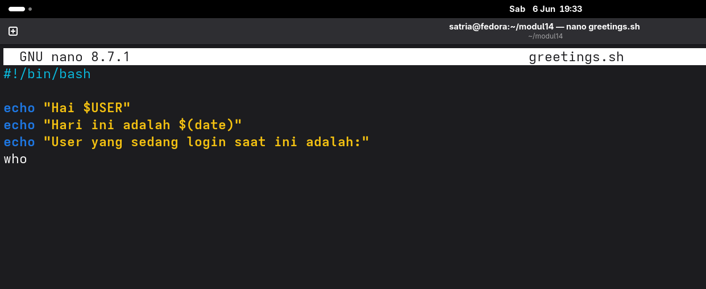

    **b. Buatlah script pada greeting.sh sehingga:**

    > 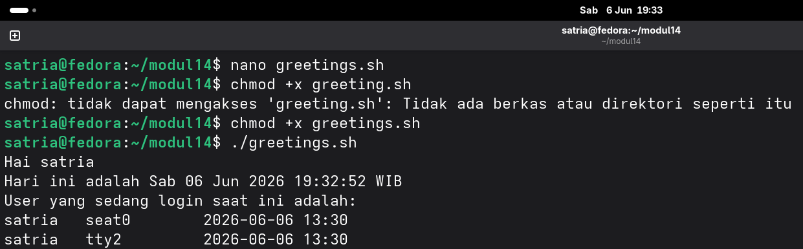

2.  [15 Poin] PENGONDISIAN (WHILE)

    **a. Buatlah file bernama greeting_1.sh sesuai dengan template code.**

    > 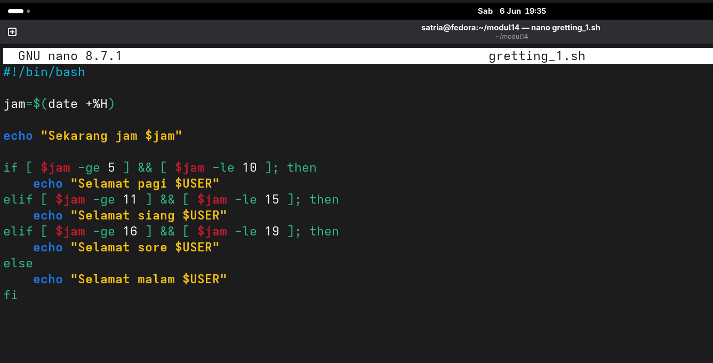

    **b. Buatlah script pada greeting_1.sh sehingga dapat menampilkan “selamat pagi” pada pagi hari (05:01-10:00), “selamat siang” pada siang hari (10:01-15:00), “selamat sore” pada sore hari (15:01-19:00) “selamat malam” pada malam hari (19:01-05:00).**

    > 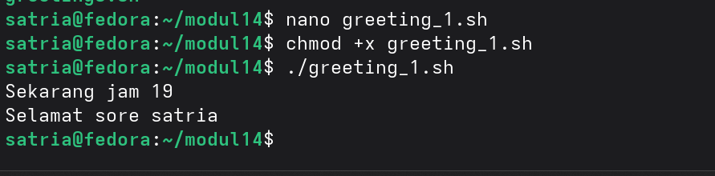

3.  [15 Poin] PERULANGAN

    **a. Buatlah file bernama countdown.sh sesuai dengan template code.**

    > 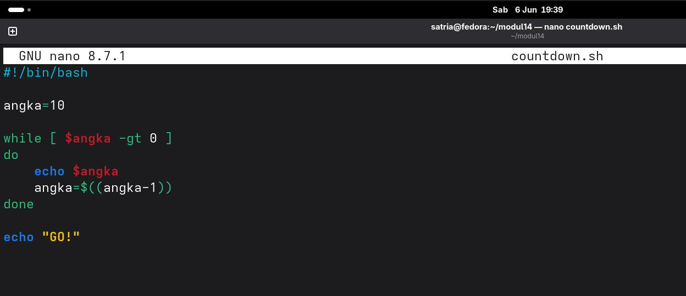

    **b. Buatlah script sehingga menghasilkan countdown dimulai dari angka 10 hingga angka 1 lalu diikuti tulisan “GO!”.**

    > 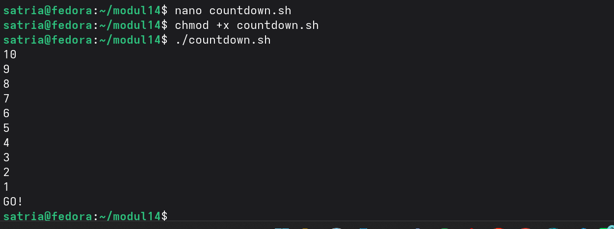

4.  [15 Poin] INPUT PENGGUNA

    **a. Buatlah file bernama countdown_1.sh sesuai dengan template code.**

    > 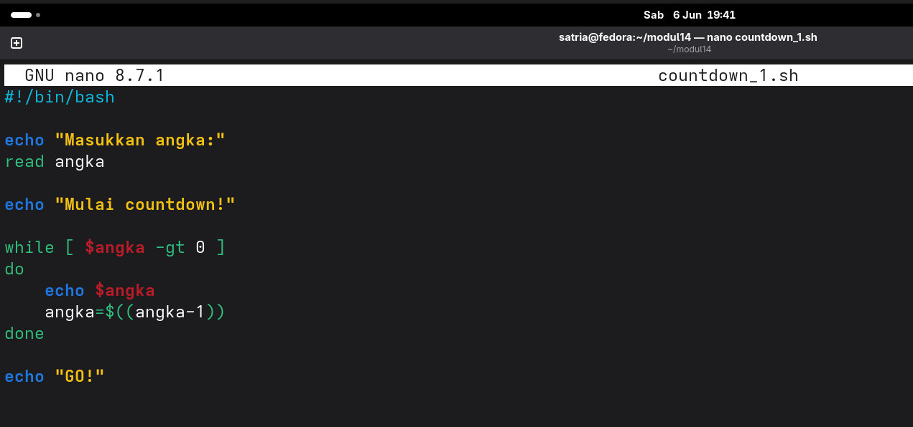

    **b. Buatlah script sehingga menghasilkan countdown berdasarkan masukan dari user.**

    > 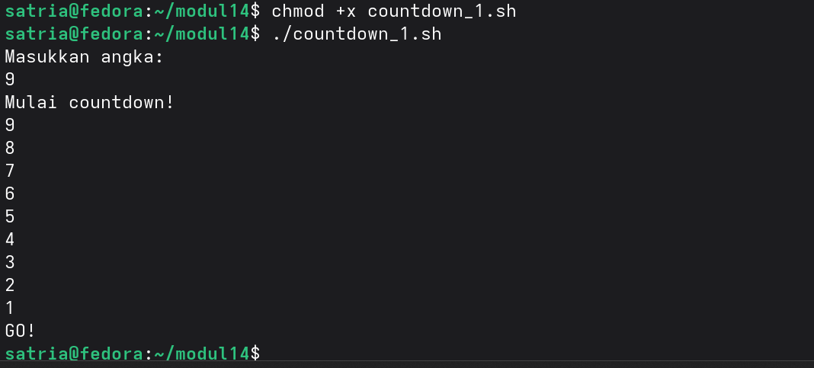

5.  [20 Poin] PARAMETER SCRIPT

    **a. Buatlah file bernama countdown_2.sh sesuai dengan template code.**

    > 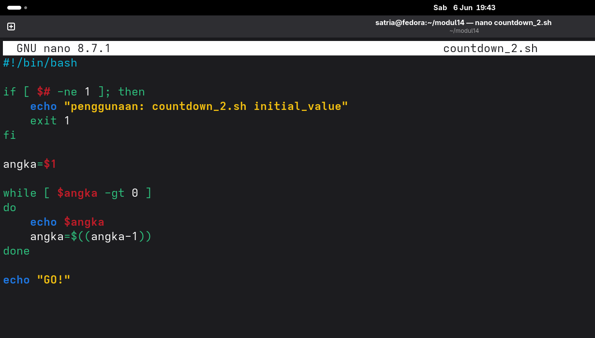

    **b. Buatlah script sehingga menghasilkan countdown berdasarkan parameter script. Pastikan kondisi-kondisi lain ditangani.**

    > 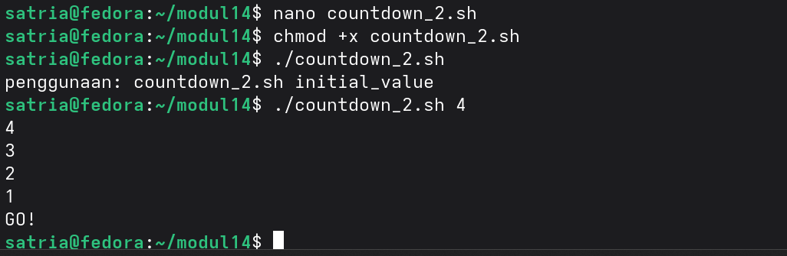

6.  [20 Poin] PENGONDISIAN (FOR, DIRECTORY)

    **a. Buatlah file bernama list_direktori.sh. Jangan lupa untuk mengubah ijin script sehingga dapat dieksekusi.**

    > 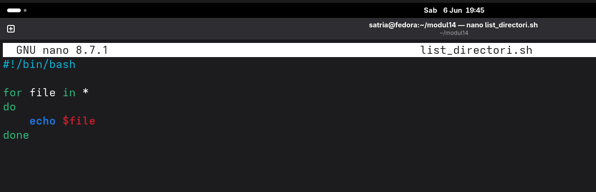

    **b. Buatlah script sehingga menampilkan semua file pada direktori tersebut.**

    > 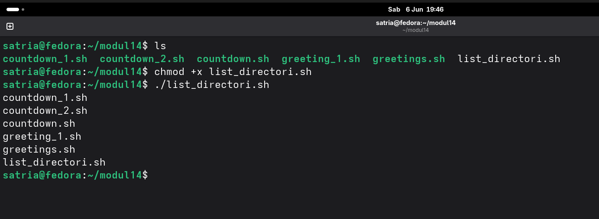

## Referensi

1. [Modul Sistem Operasi](https://telkomuniversityofficial-my.sharepoint.com/personal/maghaz_student_telkomuniversity_ac_id/_layouts/15/onedrive.aspx?id=%2Fpersonal%2Fmaghaz%5Fstudent%5Ftelkomuniversity%5Fac%5Fid%2FDocuments%2F2026%2F00%2E%20Modul%20Praktikum%20Sistem%20Operasi%20SE%202526%2D2%2Epdf&parent=%2Fpersonal%2Fmaghaz%5Fstudent%5Ftelkomuniversity%5Fac%5Fid%2FDocuments%2F2026&ga=1)
